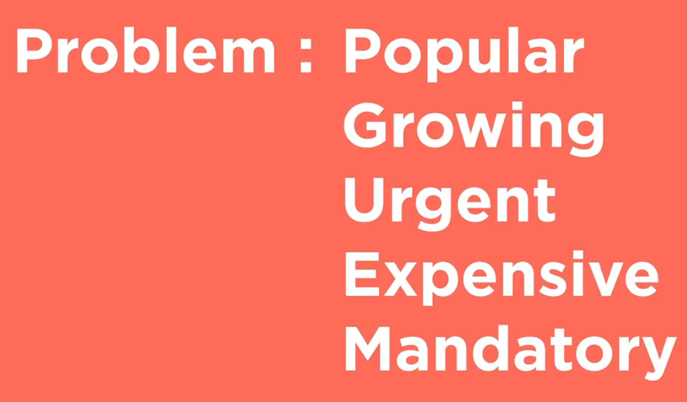
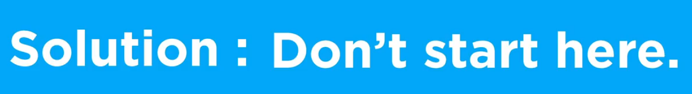

# Design

- [Design](#design)
  - [TL;DR:](#tldr)
  - [Brainstorming](#brainstorming)
    - [Problem Discovery](#problem-discovery)
    - [Incentive Alignment](#incentive-alignment)
  - [Mechanism Design 101](#mechanism-design-101)
    - [Properties](#properties)
    - [System mapping](#system-mapping)
    - [Neutrality](#neutrality)
    - [Reflexivity](#reflexivity)
    - [Governance](#governance)
  - [Mechanism Design 102](#mechanism-design-102)
    - [Stores of Value](#stores-of-value)
    - [Supply](#supply)
    - [Distribution](#distribution)
    - [Constraints](#constraints)
    - [Utilities](#utilities)
    - [Governance](#governance-1)
  - [Diagramming](#diagramming)
  - [Modeling](#modeling)
  - [Whitepaper](#whitepaper)

## TL;DR:

- Find a problem to solve.
- Understand who has that problem, why, how often, and how painful it is for them.
- Find a solution that's simple, easy, and affordable.
- Determine if a blockchain and a token system really makes sense.
- If so, define roles, methods, states for all the stakeholders who will participate in your token system (end users, providers, developers, community, etc..).
- Explore mechanisms that can help you create that system. Then if there's some you can use or modify compose them into a token system.
- Draw a picture describing the token system. Ideally showing not just the things, but the relationships between the things and how one thing affects another.
- Create a model simulating how users might interact with the token system.
- Write a blog post describing the token system. Focus on incentive alignment and checks and balances on power for all parties involved.
- Share with the community for feedback and contributions. Refine and revisit everything to make it better.

## Brainstorming

### Problem Discovery

The bigger the problem you can solve, for the most people, the more value you can create (and capture).

Ideally you want a problem that is:

- Popular (lots of people have it)
- Growing (more and more people have it)
- Frequent (they experience it a lot)
- Expensive (it's hard to solve)
- Mandatory (it must be solved)

You should be able to explain the problem you're solving, [why](https://simonsinek.com/product/start-with-why/) it's important, and how the world will be better once you've solved it. Everyone should get it. It should be so obvious they ask why they didn't think of it first. Ideally it can become a [meme](https://en.wikipedia.org/wiki/Meme). If people don't get it, work to make it simpler or find a better problem to solve.

The solution to most problems is not a blockchain. If, however, you need to coordinate multiple stakeholders to share a digital commons then a blockchain might make sense. You could create a game where rules are enforced, computed, and verified via a public blockchain. We'll call this a token system. If you design the token game correctly people will do the things that give them rewards and avoid the things that create punishments.

### Incentive Alignment

Incentives need to be aligned for individuals, but also the system as a whole. Ideally power is balanced between stakeholders. Common stakeholders are developers, service providers, and end users. They should all have aligned incentives. They should also have the ability to voice their ideas and concerns to influence the system. Tokens can give holders the right to use the network, participate in governance, and benefit from increased demand if the network is successful. It should be very clear what the rights of token holders are. The token should have a clear purpose.

**Questions to ask:**

- What problem do you want to solve?
- What will the world look like after you solve it?
- Who will benefit and why should they care?
- What problem are you solving?
- Who has this problem? How often?
- How much do they need this problem to be solved?
- How will your token contribute to solving this problem?
- Is your token incentivizing people to do work to solve the problem directly, or is it a component of a larger system that's working to solve that problem? If so, why?
- Tokens are scarce digital assets that people can own. Is there an opportunity for your token to turn what was preciously an expenditure into an investment? Ex: buying computation credits can now go from an expense to an investment in a decentralized computation system.
- What is the value prop of your token (access, unique items, discounts, governance, etc..)? Why would anyone want it?
- Is there any part of your token system (including the token itself) that could be removed while still achieving your goals?
- If you substitute a stable coin or ETH with your token will things still work? If so, then you probably don't need to create a new token.
- How will people acquire your tokens (buy, earn, gift, etc..)?
- How will the token system work with 1 user? What about 10 or 100 (bootstrapping)?
- How will the token system get better as more people use it (network effects)? How will each additional user add more value than those before as the system grows?
- Are incentives aligned for all participants of the system? Do they all participate in value creation and capture via the token?
- How will people acquire tokens (buy, earn, other)?
- How will the value of those tokens increase as the token system grows (network effects)?
- Does your token system create a network effect where the value of the network to each user grows the more users there are on the network?
- What are your project's values and how will you communicate that with users?
- In the same way the internet was a democratizing force that gave everyone in the world the ability to easily create and share information, the next step is to give everyone in the world the ability to easily create and share value. What is the value that you are creating and sharing with the world?
- To answer the question of whether the blockchain is needed, ask yourself: Does the blockchain change the system of trust in any meaningful way, or just shift it around? Does it just try to replace trust with verification? Does it strengthen existing trust relationships, or try to go against them? How can trust be abused in the new system, and is this better or worse than the potential abuses in the old system? And lastly: What would your system look like if you didn’t use blockchain at all?

**Examples:**

- TBD

**Resources:**

Many of the ideas in this section came from the following resources:

- [a16z](https://a16z.com/crypto/) has a [crypto startup school](https://a16z.com/crypto-startup-school/). It has lots of content explaining high level concepts that are essential for the space. You can also sign up for their newsletter to get ongoing insights delivered to your inbox. They also have a [tldr version here](https://a16z.com/2020/12/28/crypto-users-guide/).
- [YC's Startup School](https://www.startupschool.org/) is a great resource to help you make something people want. The [How to find startup ideas](https://www.youtube.com/watch?v=DOtCl5PU8F0) video can help build intuition for what types of problems to solve. Might help you avoid spending time working on the wrong thing. While YC is focused on startups, a lot of the same concepts around solving problems and creating value for users apply to both startups and token projects. Highly recommend checking out [their videos](https://www.youtube.com/channel/UCcefcZRL2oaA_uBNeo5UOWg).
- [The idea maze](https://a16z.com/tag/idea-maze/) can help you navigate the wild world of emerging technologies.
- [Simon Sinek](https://simonsinek.com/) has a lot of great content explaining why you should [start with why](https://simonsinek.com/product/start-with-why/).
- [Bruce Schneier](https://www.schneier.com/blog/archives/2019/02/blockchain_and_.html) has some great points as to why you might not want a blockchain. You should only use a blockchain if you really need one.

## Mechanism Design 101

> Developing intuition.

### Properties

Before jumping into design, or even implementation, it's good to think about the [properties and values you want the token system to express](https://www.youtube.com/watch?v=6ufHL5AkBEA). These should be concrete properties that your system will maintain under all conditions. This way with each mechanism you add to your system, and the system as a whole, you can check to ensure that it expresses the project's core principles. Some common principles many Web3 projects strive for are:

- **Permissionless:** anyone can interact with the contracts.
- **Trustless:** the contract run deterministically.
- **Secure:** the code does what it says it does without unexpected behavior.

Then once you know what you want to do, you have to figure out how. First know what you want to do, then find tools that can help you do it. Don't start with the tools! If you do you'll become a man with a hammer. Choose the tools based on your goals and design constraints, not the other way around.

The first step is just describing what you want to do. Write it down. You should be able to answer who, what, when, where, why.

### System mapping

A way to define these things in the context of a digital system is rights, roles, and access. Who can do what and under what circumstances. This is similar to [Ostrom's institutional analysis and development framework](https://en.wikipedia.org/wiki/Institutional_analysis_and_development_framework) as well as [linux system permissions](https://www.digitalocean.com/community/tutorials/an-introduction-to-linux-permissions).

- **State:** all of the information in the system.
- **Users:** actors who can engage with the system.
- **Actions:** things users can do.
- **Rights:** the authority to take an action or access part of the state.
- **Roles:** bundles of rights assigned to users.

Starting with "who," users/stakeholders might include:

- **End users:** acquire tokens to access goods and services.
- **Service providers:** provide services to earn rewards.
- **System designers:** design tokenomic systems for fun and profit.
- **Community developers:** build software for fun and profit.
- **Third-party developers:** create integrations for their product or service.
- **Protocol politicians:** create and/or explain governance proposals to other stakeholders.
- **Investors:** contribute capital and do work to improve their investments.
- **Traders:** mercenary capital that chases opportunities such as market volatility, arbitrage, portfolio diversification, etc..

The state of your system will be the "what" and the 'where." A blueprint of the system. This is what you'll have at the end of the design phase.

"When" explores how your system handles time. If you have governance this will often relate to voting or delay windows before actions can be taken.

To answer "how" we need to map actions to mechanisms. Mechanisms are how methods get instantiated. First just describe each mechanism and what it should do. Then as your token system evolves you can add more details.

Then once you have a set of mechanisms you can define who can engage with those mechanisms. Roles are a way to group assignments of rights to actors within the system. If you're familiar with linux permissions this is similar to user groups. In this case, however, we're assigning rights to tokens. Then addresses holding tokens will have a role and the rights associated with it.

You might also want to think about the process to modify the rights associated with roles. This would add a layer of [meta governance](https://en.wikipedia.org/wiki/Governance#Metagovernance) to the system enabling actors to change the system itself. This is a double edged sword. More [flexibility allows for adaptation, but also decreases stability](https://thedefiant.substack.com/p/we-need-to-re-think-decentralized-5df). The more a system can change the more power shifts from the mechanism design to the subjective judgement of actors within the system.

At this point everything should still be high level. We're not choosing a programming language, framework, blockchain or L2 solution. We're just describing the system.

### Neutrality

Decentralized protocols are valuable because they create credible commitments about the rules of the game. You can read the code, understand how the system works, and know that everyone interacting with the system has to play by the same rules. When this happens tokens systems can be said to be [credibly neutral](https://nakamoto.com/credible-neutrality/).

Rights access paradigms are a way to explicitly model and reason through [the fairness of your token system](https://en.wikipedia.org/wiki/Original_position). To do this we need to map out rights and access controls to show who can do what, how people can move through the system, and how the system itself can be changed (if at all). This way everyone can engage with full information.

Once the system is mapped out everyone can see the roles available as well as the path to move from one role to another. This might be as simple as acquiring tokens to stake or as complex as drafting a governance proposal to create the changes you want to see. It's important that this process feels fair. There needs to be a meaningful way to contribute to and level up within the system. Projects with high degrees of agency and mobility tend to attract more users and contributors. This can help you grow faster and/or save you time and money on marketing simply because incentives are aligned for all parties involved.

### Reflexivity

> Add some info and resources to explore reflexivity, both in the context of growth and network effects (good) as well as unexpected incentive feedback loops that could lead to rewarding people for things that don't drive fundamental value for the system (less good).

https://danco.substack.com/p/rwhitehousebets

### Governance

Some systems need human input. If so, then you have a governance problem. How you solve this coordination problem depends on what you're trying to achieve. Any governance solution you choose is a means to an end, not an end in itself. It needs to be simple and intuitive. Then people can collectively create the changes they want.

Another way of framing this is as a rights/roles access problem. Through this lens it should be clear what the rules actually are, who can do what when, and how people participating in the system can change the rules of the system. This way everyone has complete information.

Then once people know what's going on, even if they don't agree with every decision, they can at least respect the process that resulted in that decision. This is very important. We don't need complete agreement on every decision, but we do need to agree on how we make decisions.

Then players who choose to play the game will have [voice, loyalty, and exit](https://en.wikipedia.org/wiki/Exit,_Voice,_and_Loyalty). Everyone will have all the information they need to create informed opinions. They'll have a process to share ideas and affect change. They'll also be able to leave the system if they disagree with decisions being made. The more agency players have the more their loyalty to the game will increase. While this can be intense and time consuming, it's a good sign that [people care](https://www.pet3rpan.net/blog/why-do-people-care).

If you don't want to design a governance process from day 1 you can leave it as an upgrade for the future. You don't have to choose right now, but it's important to think about. Thyen in the future if you want to set control of contracts to a community multi-sig or DAO in the future you can, but you could also set it to the 0 address so that the contract becomes immutable.

**Questions to ask:**

- What is your token system supposed to incentivize people to do?
- Who are the participants who will use the token in some way?
- How can you align incentives for all parties involved?
- Is your token system simple and intuitive? If not, why not and is there anything you can do to make it simpler while still aligning incentives for all parties involved?
- What are the requirements for participation?
- What the current rules are and how to change the rules?
- Do you feel like your token system if "fair?" If so, would you be comfortable being dropped into a random role in the system?
- Are there aspects of your system that will need to adapt and change over time? If so, who has the right to make that change? What is the process to make that change?
- Is it possible to change the process to make changes (meta-governance)?
- Is there any way for you to minimize governance while still giving users control over your token system? It's very important to make your governance process as simple as possible.
- Do all parties involved in your token system (end users, service providers, token holders, etc..) have tokens so that they can participate in the financial upside and management of the token system? If not, why not? How can you enable more stakeholders to participate in a meaningful way?
- Are there features you want that aren't available via any of the token system templates available?
- How will the addition of a feature/mechanism affect your token economy? Will it increase velocity or create a sink that locks up supply (and liquidity)?
- Can you easy answer who, what, when, where, and why questions about your token system?

**Examples:**

- 1Hive Luna swarm
- Gitcoin cadCAD stuff

**Resources:**

- Vitalik's blog has a great [coordination post](https://vitalik.ca/general/2020/09/11/coordination.html) that can help you build intuition around aligning interests for all parties involved in a token system.
- The [Wikipedia mechanism design page](https://en.wikipedia.org/wiki/Mechanism_design). Is a great place to start. If you read one thing on mechanism design, make it this. There's also a whole [category on Wikipedia dedicated to the topic](https://en.wikipedia.org/wiki/Category:Mechanism_design).
- [a16z's crypto startup school](https://a16z.com/2020/12/28/crypto-users-guide/) has a great talk with Sam Williams from [Arweave](https://www.arweave.org/) exploring [how to think about incentives in token systems](https://www.youtube.com/watch?v=gCFlGLbI_kE).
- The Foundations of Cryptoeconomic Systems [lecture](https://www.youtube.com/watch?v=HldQF_MJN_Y) and [paper](https://epub.wu.ac.at/7309/) can help you build intuition around token system design. Beyond that, all the [resources on the BlockScience website](https://block.science/resources) are good.
- [Web3 Revenue Primitives](https://github.com/FEMBusinessModelsRing/web3_revenue_primitives) - An open source list of business models that might be helpful for Web3 projects.
- If you're going to include governance Placeholder VC has a post exploring [ten thesis on decentralized network governance](https://www.placeholder.vc/blog/2020/9/30/ten-theses-on-decentralized-network-governance).
- [A Token Engineering Process](https://medium.com/@stephen_yo/a-token-engineering-process-16687f3b9a74) - Great article that covers the basics of system mapping and diagramming in the context of token engineering. More great articles on the token engineering process [here](https://blog.oceanprotocol.com/towards-a-practice-of-token-engineering-b02feeeff7ca) and [here](https://medium.com/block-science/on-the-practice-of-token-engineering-part-i-c2cc2434e727)
- [Re-thinking decentralized governance](https://thedefiant.substack.com/p/we-need-to-re-think-decentralized-5df) - Blake West has some great points on why you want to minimize governance to maximize protocol decentralization and autonomy.
- [Linux permissions](https://www.digitalocean.com/community/tutorials/an-introduction-to-linux-permissions) can provide a simple way to think about rights, roles, and access at a system level.
- [Original position](https://en.wikipedia.org/wiki/Original_position) describes how to think through desigining a system that is fair and egalitarian.
- [Exit, voice, and loyalty](https://en.wikipedia.org/wiki/Exit,_Voice,_and_Loyalty) are important concepts to think about as you're designing the available action space for stakeholders.
- [Token Engineering community](https://tokenengineeringcommunity.github.io/website/) - A community working to further the discipline of token engineering through education and outreach. Check out their [Library](https://tokenengineeringcommunity.github.io/website/docs/library-te-101) for more resources.
- [CommonsStack](https://commonsstack.org/) - A community working to create templates and best practices to realign incentives around public goods.
- [cadCAD Edu](https://www.cadcad.education/) is a great resource to learn about the token engineering process. While it's focused on cadCAD, the Complete Foundations Bootcamp is a great intro to the token engineering design process as a whole.

## Mechanism Design 102

> Exploring common mechanisms
> Describe the notion of the design space as an open creative design space
> Here's some examples of some common things
> Talk about design as a language
> mechanisms, protocols, systems etc... that you can combine to express things
> build an intuition around the design space like language so you can read and write

This section will explore common Web3 mechanisms and standards. It will be focused at the design level. Implementations of said mechanisms will be left for the [Development](#development) section.

- Value (aka tokens)
  - Type
    - Fungible
      - 20
    - Non-fungible
      - 721
      - 1155
  - Supply
    - Fixed
      - most ICOs
    - Continuous
      - bonding curve
      - elastic rebasing
    - Inflationary
      - BTC
    - Deflationary
      - maybe soon ETH
- Incentives (aka finance)
  - vaults
  - poison pill
  - rage-quit
  - various "mining" programs
  - discount tokens
  - airdrop to users
  - time locks (aka staking)
  - token permissioned things
  - dividends/royalties
- Power (aka governance)
  - admin
  - multi-sigs
  - token weighted voting/signalling
    - quadradic
    - conviction
    - ranked choice
    - wait for quiet
    - time boxed or continuous
    - simple or super majority
    - direct or delegated
    - etc..

### Stores of Value

> The goal of this section is to explore a few of the different token standards around, their properties, and how you might use them.

Tokens can be many things: units of account, mediums of exchange, stores of value, and more. They're a scarce digital asset. They can be both fungible and non-fungible. How they're used determines their value to those who use them. It's subjective. Given the permissionless nature of blockchain technology it's possible (likely even) that use cases for tokens grow over time. Imagine a token that starts as a way to access a chat, that then gets incorporated into a dApp, and that then becomes a currency used for all sorts of things within a community.

Fungible tokens are tokens that can be exchanged for one another. All tokens are the same. There's no way to differentiate between them. This is the most common type of token. It's often used to represent commodities or financial assets. These tokens are easy to trade and price via decentralized markets.

- LINKS TO FUNGIBLE TOKEN RESOURCES GO HERE

Non-fungible tokens (NFTs) are unique. They have a provenance and story. These are often used to represent collectibles. The structure of many NFTs allows for data to be stored within the token itself making it great for artists, creators, and games. These tokens are often priced much more subjectively. While there might be a market of buyers for NFTs in general, each NFT is bought and sold independently making price discovery much more subjective.

- LINKS TO NON-FUNGIBLE TOKEN RESOURCES GO HERE

### Supply

With both fungible and non-fungible tokens the supply is important. Fungible tokens can become scarce collectibles if there's a lot of demand and limited supply. NFTs can also act like commodities if many editions are created. Token supply should be related to the use case. One size does not fit all. Some variables to consider are:

- Fixed vs continuous supply: if you want your token to be a rare collectible asset then it's likely going to have a fixed or limited supply. If, however, you want it to act like a commodity then it's supply might be linked to a productive output such as work contributed or collateral locked.
- Scarce vs widely distributed asset: if the goal of your token is to engage the community, capitalize the network, and align incentives and power between multiple stakeholders then you'll want to distribute the token widely. (see Incentives section for token distribution mechanisms)

Fixed supply means that the supply will not change. The tokens are minted and that's it.

Continuous supply includes many things including, but not limited to:

- governance mechanisms that allow parties to mint more tokens in tranches
- monetary policies that result in token inflation or deflation
- user controlled mechanisms such as bonding curves

Scarce tokens are few and far between. They're rare. This can be great for concentrating power, attention, and price action.

Widely distributed tokens are plentiful. They enable commerce, governance, and other activities to occur. These tokens get their value not from their scarcity, but from the fact that they are used by many people in many places. Network effects.

### Distribution

> This section explores mechanisms to distribute tokens.

- airdrop to users
- various "mining" programs
- staking to earn (often NFTs)
- etc..

### Constraints

> This section explore mechanisms that can control or shape the distribution, supply, or useage of tokens. Things like poison pills, time locks, account limits, dividends, etc..

- poison pill
- rage-quit
- time locks (aka staking)
- etc..

### Utilities

> Things that can give tokens more value/utility

**Token permissioning:**

- chats (community)
- services (SaaS)
- data (newsletters)

**Discount tokens:**

- A discount token gives the holder a discount on a product or service.
- The discount token yield (aggregate and user-level) grows proportionally to network usage (demand for products/services).
- The discount yield returns more benefits to users than passive token holders. Users will rationally acquire discount tokens to get a discount on services they use (think Amazon Prime). This would be more relevant if we develop services that resemble a SaaS model (community analytics, ongoing consultations/support, etc..)
- The denomination of fees may be in any form, such as a utility token or stablecoin. This makes pricing much easier.
- Learn more about discount tokens via this [overview](https://blog.coinfund.io/the-fundamentals-of-discount-tokens-cc400c66198e) and the [Sweetbridge discount token paper (PDF)](https://sweetbridge.com/assets/docs/WP-Sweetbridge-Discount-Tokens.pdf).

**Dividends and royalties:**

- Talk about mechanisms that return a portion of the value earn by a thing (dApp, protocol, etc..) to token holders (often staked).
- Staking/inflationary rewards may or may not also qualify.

**Collateral:**

- Tokens backed by collateral command a monetary premium on top of their utility, commodity value, governance power, etc..
- Bonding curves are a great example here.

### Governance

> This section explores mechanisms that allow for collective decision making. Note, this might include mechanisms as well as policies as both could be viewed as design patterns.

Patterns:

- admin
- multi-sigs
- quadradic
- conviction
- ranked choice
- wait for quiet
- time boxed or continuous
- simple or super majority
- direct or delegated
- etc..

## Diagramming

> A picture says a thousand words!
> Block diagrams (abstractions of logic - fundamental to systems engineering) => economic games as estimators
> Makes it clear where the information is coming from
> Representing composed primitives (mZ will have some examples in the future)
> AMM (swap, borrow, repay) => those three things allow for lots of actions and systems when you combine the and use them in different ways - or compose them with other systems
> Simple design that is very expressive
> Mechanism composition diagrams (TBD)

Diagramming can help you refine your understanding of the system and it's components. It's also useful when you want to communicate your vision to others. There are many types of diagrams and charts, but what's best for your use case and audience may vary.

**Questions to ask:**

- What are the key components of your system that you want to understand and communicate?
- What are the relationships between those things and/or what things affect them?
- Is the organization of your diagram intuitive (color coding, labels, use of space, etc..)?

**Examples:**

> Actual diagrams of systems go here.

**Resources:**

- [Causal loop diagrams](https://en.wikipedia.org/wiki/Causal_loop_diagram) can help you see the relationships between components of your system. These types of diagrams are generally very high level, but great for quickly illustrating things (like the network effects of your token system). As such they're great for blog posts and outward facing communications. CAUSAL LOOP TEMPLATE GOES HERE.
- Stock and flow diagrams also show the relationship between things, but often in more detail than a causal loop.
- [The cadCAD differential specification template](`https://community.cadcad.org/t/differential-specification-syntax-key/31`) is a good exercise to help you think through all the variables at play in your system and how they relate to each other. There's a [Figma template](https://www.figma.com/file/yBgOopbmcdkYxo2jDNmua1/cadCAD-Diff-Spec-Syntax?node-id=0%3A1) or you can create your own in your favorite diagramming software.
- cadCAD diagrams can be generated for any cadCAD model. It's often as simple as adding a single line of code after you run the model. The [cadCAD Diagram repo](https://github.com/cadCAD-org/cadCAD_diagram) has more information on how to set that up.
- Solidity contract diagrams can be generated via [Surya](https://github.com/ConsenSys/surya) and/or the [VSCode Soldity Visual Developer extension](https://marketplace.visualstudio.com/items?itemName=tintinweb.solidity-visual-auditor). You can also manually create diagrams that show each function, it's inputs, and outputs. This can help you (and your community) understand the boundaries of your contract and the permissions and relationships between functions.
- [Figma](https://www.figma.com/) - Proprietary (but atm free to use) design platform that has become the standard for designers. Great if you want to share designs/diagrams with a larger audience and/or make them look pretty.
- [Lucid chart](https://www.lucidchart.com/) - Diagramming software for engineers. Proprietary: free to try, but you'll have to pay if you want to use it on a real project.
- [Whimsical](https://whimsical.com/) - Super simple diagramming software. Also proprietary, free to try, and you'll have to pay for extra features if you want to use it on a real project.
- [cadCAD](https://github.com/cadCAD-org/cadCAD_diagram) - cadCAD (free and open source) has diagramming built in, but it's only for the cadCAD model.
- [Surya](https://github.com/ConsenSys/surya) - Free and open source tool to visualize Solidity contracts.
- [Solidity Visual Developer](https://marketplace.visualstudio.com/items?itemName=tintinweb.solidity-visual-auditor) - [Visual Studio Code](https://code.visualstudio.com/) extension that uses Surya and other things to visualize your Solidity code.

## Modeling

> You don't know what you don't know.
> Distinguish between mathematic and computational modeling
> Modeling: the act of representing the system in concrete terms.
> Mathematic models usually come before the computation models. Define, then instantiate.
> Often the mathematic part can be in the Markdown comments of the docs if it's simple enough.
> Courses in systems dynamics are often where people learn this.
> If you don't do the math your performative assumptions are biased.
> Creates reflexivity where you interpret your own interpretations.
> Mathematic modeling make explicit your own assumptions about the world. Model of world as well as model of mechanisms.
> Mathematics as ingredients.
> Forces you to turn vague ideas into something concrete. Clarifies assumptions and/or highlights oversights.
> Opposite of lifting out patterns. Idea => concrete thing.
> Model is an instantiation of concepts. but you need to retain the idea that it could be different depending on how the implementation looks. Then can iterate around instances to find the right ones to express the pattern.
> Iterate around the instance to represent the pattern in the context of your use case.
> Helps you detect breakdowns when the context the instance is operating inside of changes - then you understand when and where the instance/model works in which contexts. Then you know when things change.
> For a maths resource add mZ's paper on configurations of state spaces: https://epub.wu.ac.at/7385/1/zargham_shorish_paruch.pdf

A good model provides insights into how your token system would function under various conditions. This can help you check to see if your design goals are likely to hold as usage, price, and other important parameters change. Before you start modeling it's important to know what you want to have happen as well as what are the unknowns you're trying to understand. Ideally these unknowns can be stated as concrete questions. This way you have a clear goal, but also others who contribute to and/or review your model have something concrete to orient around.

Modeling Checklist:

- state variables
- system parameters
- helper functions
- policy functions
- state update functions
- state update configuration
- runtime configuration
- execution
- output formatting
- output visualization

**Questions to ask:**

- What are the design goals of your system?
- What are the unknown states or variables of your system?
- What questions are you trying to build intuition around via your model?

**Examples:**

- The [cadCAD GitHub org](https://github.com/cadCAD-org) has many [demos](https://github.com/cadCAD-org/demos).
- The [Gitcoin cadCAD model](https://github.com/gitcoinco/gitcoin_cadcad_model) is open source.
- Ocean Protocol created a python model called [TokenSpice](https://github.com/oceanprotocol/tokenspice2).
- 1Hive created a [cadCAD model for conviction voting](https://github.com/1Hive/conviction-voting-cadcad) which they use to inform their governance parameters as well as the token supply schedule.

**Resources:**

- [Python](https://www.python.org/) - You can create your modeling framework in python like Ocean Protocol did with [TokenSpice](https://github.com/oceanprotocol/tokenspice2).
- [cadCAD](https://cadcad.org/) is a python based library for modeling complex systems. There's free and open source [demos and tutorials](https://github.com/cadCAD-org/demos). There's also some [templates](https://github.com/cadCAD-org/snippets) to help you get started with your own models. If you have questions there's a [community forum](http://community.cadcad.org/) and [Discord](https://discord.gg/cewBa9zsxS).
- [Machinations](https://machinations.io/) - A platform and graphical interface for designing and simulating games.

## Whitepaper

> Sharing is caring
> Add more stuff here about open source design, peer review, community engagement to check bugs and provide new ideas
> Challenge assumptions as well as the design
> Build buy in and community so that you know you have an idea worth pursuing
> Communicating and sharing the ideas as part of designing the ideas
> It's not just the code, but also the people. You need both
> Need a few laps through the design process before moving onto development
> Review as part of the design process
> Add notes reminding people to list citations! and recommend a way to do so in a practical way

Once you've identified a problem to solve, people who have that problem, and how you're going to solve it for them you should write it down! This will help you clarify your thinking. It will also help you communicate your vision to others. Then they might join you on your quest and/or point out ways that you might improve things.

To start, keep it simple. Just create a single page that describes what you're trying to do, why, and how. Eventually this might evolve into a formal specification, but right now we just want a rough sketch that's simple and intuitive. You can then update this as you design, develop, and deploy your token system. Then share it as a blog post or white paper. For now, keep it in a format (Google docs, HackMD, GitHub repo, etc..) that people can easily read, review, and comment on. This can help catch errors early on as well as engage your community.

The paper should describe the various components that are composed to achieve your goal, the properties of each mechanism, and the properties of your system as a whole.

It should also talk about why anyone could/should/would care about your token. You should explain why your token is useful (aka provide value) and how that will drive demand (resulting in a high token price). Supply and demand 101, with tokens. It ain't much, but it's honest work.

**Questions to ask:**

- Who is the audience?
- What are you trying to communicate to them?
- What is the action you'd like them to take as a result of reading your paper (provide feedback, contribute, etc..), and how can they do that (comments, GitHub Issues, community chat, etc..)?

**Examples:**

- For an excellent example of a specification, look at [Signal’s breakdown of their Double Ratchet Algorithm](https://signal.org/docs/specifications/doubleratchet/).
- The [Bitcoin whitepaper](https://bitcoin.org/bitcoin.pdf) is a well known example of a paper that changed the world.

**Resources:**

- [HackMD](https://hackmd.io/) - A free and simple web based Markdown editor.
- [VSCodium](https://vscodium.com/) - The 100% open source no telemetry version of VSCode.
