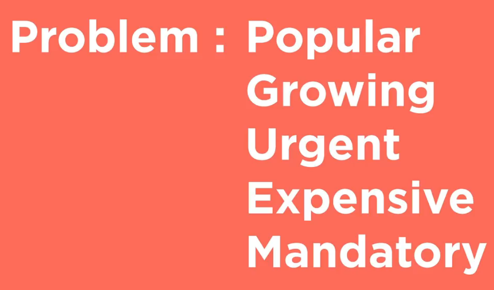
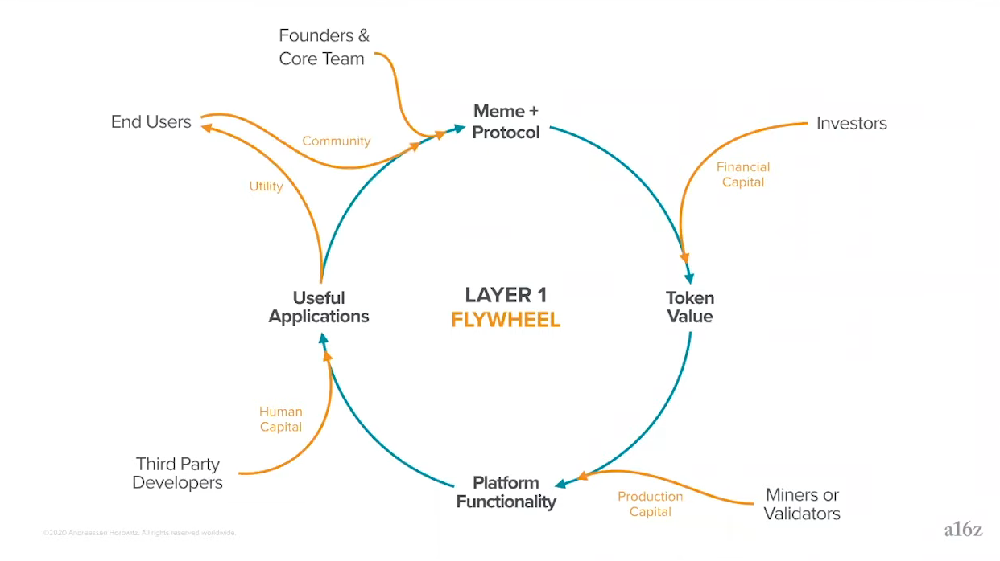

# The Workbook

- [The Workbook](#the-workbook)
  - [Design](#design)
    - [TL;DR:](#tldr)
    - [Brainstorming](#brainstorming)
    - [Mechanism Design 101](#mechanism-design-101)
    - [Mechanism Design 102](#mechanism-design-102)
    - [Diagramming](#diagramming)
    - [Modeling](#modeling)
    - [Whitepaper](#whitepaper)
  - [Development](#development)
    - [TL;DR:](#tldr-1)
    - [Templates](#templates)
    - [Building](#building)
    - [Audits and Reviews](#audits-and-reviews)
    - [Economic Review](#economic-review)
    - [Technical Review](#technical-review)
  - [Deployment](#deployment)
    - [TL;DR:](#tldr-2)
    - [Beta Testing](#beta-testing)
    - [Shipping](#shipping)
    - [Monitoring](#monitoring)
    - [Governance](#governance)
    - [Communities](#communities)
    - [Upgrades](#upgrades)

## Design

### TL;DR:

- Find a problem to solve.
- Understand who has that problem, why, how often, and how painful it is for them.
- Find a solution that's simple, easy, and affordable.
- Determine if a blockchain and a token system really makes sense.
- If so, define roles, methods, states for all the stakeholders who will participate in your token system (end users, providers, developers, community, etc..).
- Explore mechanisms that can help you create that system. Then if there's some you can use or modify compose them into a token system.
- Draw a picture describing the token system. Ideally showing not just the things, but the relationships between the things and how one thing affects another.
- Create a model simulating how users might interact with the token system.
- Write a blog post describing the token system. Focus on incentive alignment and checks and balances on power for all parties involved.
- Share with the community for feedback and contributions. Refine and revisit everything to make it better.

### Brainstorming

The bigger the problem you can solve, for the most people, the more value you can create (and capture).

Ideally you want a problem that is:

- Popular (lots of people have it)
- Growing (more and more people have it)
- Frequent (they experience it a lot)
- Expensive (it's hard to solve)
- Mandatory (it must be solved)

You should be able to explain the problem you're solving, [why](https://simonsinek.com/product/start-with-why/) it's important, and how the world will be better once you've solved it. Everyone should get it. It should be so obvious they ask why they didn't think of it first. Ideally it can become a [meme](https://en.wikipedia.org/wiki/Meme). If people don't get it, work to make it simpler or find a better problem to solve.

The solution to most problems is not a blockchain. If, however, you need to coordinate multiple stakeholders to share a digital commons then a blockchain might make sense. You could create a game where rules are enforced, computed, and verified via a public blockchain. We'll call this a token system. If you design the token game correctly people will do the things that give them rewards and avoid the things that create punishments.

Incentives need to be aligned for individuals, but also the system as a whole. Ideally power is balanced between stakeholders. Common stakeholders are developers, service providers, and end users. They should all have aligned incentives. They should also have the ability to voice their ideas and concerns to influence the system. Tokens can give holders the right to use the network, participate in governance, and benefit from increased demand if the network is successful. It should be very clear what the rights of token holders are. The token should have a clear purpose.

**Questions to ask:**

- What problem do you want to solve?
- What will the world look like after you solve it?
- Who will benefit and why should they care?
- What problem are you solving?
- Who has this problem? How often?
- How much do they need this problem to be solved?
- How will your token contribute to solving this problem?
- Is your token incentivizing people to do work to solve the problem directly, or is it a component of a larger system that's working to solve that problem? If so, why?
- Tokens are scarce digital assets that people can own. Is there an opportunity for your token to turn what was preciously an expenditure into an investment? Ex: buying computation credits can now go from an expense to an investment in a decentralized computation system.
- What is the value prop of your token (access, unique items, discounts, governance, etc..)? Why would anyone want it?
- Is there any part of your token system (including the token itself) that could be removed while still achieving your goals?
- If you substitute a stable coin or ETH with your token will things still work? If so, then you probably don't need to create a new token.
- How will people acquire your tokens (buy, earn, gift, etc..)?
- How will the token system work with 1 user? What about 10 or 100 (bootstrapping)?
- How will the token system get better as more people use it (network effects)? How will each additional user add more value than those before as the system grows?
- Are incentives aligned for all participants of the system? Do they all participate in value creation and capture via the token?
- How will people acquire tokens (buy, earn, other)?
- How will the value of those tokens increase as the token system grows (network effects)?
- Does your token system create a network effect where the value of the network to each user grows the more users there are on the network?
- What are your project's values and how will you communicate that with users?
- In the same way the internet was a democratizing force that gave everyone in the world the ability to easily create and share information, the next step is to give everyone in the world the ability to easily create and share value. What is the value that you are creating and sharing with the world?
- To answer the question of whether the blockchain is needed, ask yourself: Does the blockchain change the system of trust in any meaningful way, or just shift it around? Does it just try to replace trust with verification? Does it strengthen existing trust relationships, or try to go against them? How can trust be abused in the new system, and is this better or worse than the potential abuses in the old system? And lastly: What would your system look like if you didn’t use blockchain at all?

**Examples:**

- TBD

**Resources:**

Many of the ideas in this section came from the following resources:

- [a16z](https://a16z.com/crypto/) has a [crypto startup school](https://a16z.com/crypto-startup-school/). It has lots of content explaining high level concepts that are essential for the space. You can also sign up for their newsletter to get ongoing insights delivered to your inbox. They also have a [tldr version here](https://a16z.com/2020/12/28/crypto-users-guide/).
- [YC's Startup School](https://www.startupschool.org/) is a great resource to help you make something people want. The [How to find startup ideas](https://www.youtube.com/watch?v=DOtCl5PU8F0) video can help build intuition for what types of problems to solve. Might help you avoid spending time working on the wrong thing. While YC is focused on startups, a lot of the same concepts around solving problems and creating value for users apply to both startups and token projects. Highly recommend checking out [their videos](https://www.youtube.com/channel/UCcefcZRL2oaA_uBNeo5UOWg).
- [The idea maze](https://a16z.com/tag/idea-maze/) can help you navigate the wild world of emerging technologies.
- [Simon Sinek](https://simonsinek.com/) has a lot of great content explaining why you should [start with why](https://simonsinek.com/product/start-with-why/).
- [Bruce Schneier](https://www.schneier.com/blog/archives/2019/02/blockchain_and_.html) has some great points as to why you might not want a blockchain. You should only use a blockchain if you really need one.

### Mechanism Design 101

> Developing intuition.

Before jumping into design, or even implementation, it's good to think about the [properties and values you want the token system to express](https://www.youtube.com/watch?v=6ufHL5AkBEA). These should be concrete properties that your system will maintain under all conditions. This way with each mechanism you add to your system, and the system as a whole, you can check to ensure that it expresses the project's core principles. Some common principles many Web3 projects strive for are:

- **Permissionless:** anyone can interact with the contracts.
- **Trustless:** the contract run deterministically.
- **Secure:** the code does what it says it does without unexpected behavior.

Then once you know what you want to do, you have to figure out how. First know what you want to do, then find tools that can help you do it. Don't start with the tools! If you do you'll become a man with a hammer. Choose the tools based on your goals and design constraints, not the other way around.

The first step is just describing what you want to do. Write it down. You should be able to answer who, what, when, where, why.

A way to define these things in the context of a digital system is rights, roles, and access. Who can do what and under what circumstances. This is similar to [Ostrom's institutional analysis and development framework](https://en.wikipedia.org/wiki/Institutional_analysis_and_development_framework) as well as [linux system permissions](https://www.digitalocean.com/community/tutorials/an-introduction-to-linux-permissions).

- **State:** all of the information in the system.
- **Users:** actors who can engage with the system.
- **Actions:** things users can do.
- **Rights:** the authority to take an action or access part of the state.
- **Roles:** bundles of rights assigned to users.

Starting with "who," users/stakeholders might include:

- **End users:** acquire tokens to access goods and services.
- **Service providers:** provide services to earn rewards.
- **System designers:** design tokenomic systems for fun and profit.
- **Community developers:** build software for fun and profit.
- **Third-party developers:** create integrations for their product or service.
- **Protocol politicians:** create and/or explain governance proposals to other stakeholders.
- **Investors:** contribute capital and do work to improve their investments.
- **Traders:** mercenary capital that chases opportunities such as market volatility, arbitrage, portfolio diversification, etc..

The state of your system will be the "what" and the 'where." A blueprint of the system. This is what you'll have at the end of the design phase.

"When" explores how your system handles time. If you have governance this will often relate to voting or delay windows before actions can be taken.

To answer "how" we need to map actions to mechanisms. Mechanisms are how methods get instantiated. First just describe each mechanism and what it should do. Then as your token system evolves you can add more details.

Then once you have a set of mechanisms you can define who can engage with those mechanisms. Roles are a way to group assignments of rights to actors within the system. If you're familiar with linux permissions this is similar to user groups. In this case, however, we're assigning rights to tokens. Then addresses holding tokens will have a role and the rights associated with it.

You might also want to think about the process to modify the rights associated with roles. This would add a layer of [meta governance](https://en.wikipedia.org/wiki/Governance#Metagovernance) to the system enabling actors to change the system itself. This is a double edged sword. More [flexibility allows for adaptation, but also decreases stability](https://thedefiant.substack.com/p/we-need-to-re-think-decentralized-5df). The more a system can change the more power shifts from the mechanism design to the subjective judgement of actors within the system.

At this point everything should still be high level. We're not choosing a programming language, framework, blockchain or L2 solution. We're just describing the system.

Decentralized protocols are valuable because they create credible commitments about the rules of the game. You can read the code, understand how the system works, and know that everyone interacting with the system has to play by the same rules. When this happens tokens systems can be said to be [credibly neutral](https://nakamoto.com/credible-neutrality/).

Rights access paradigms are a way to explicitly model and reason through [the fairness of your token system](https://en.wikipedia.org/wiki/Original_position). To do this we need to map out rights and access controls to show who can do what, how people can move through the system, and how the system itself can be changed (if at all). This way everyone can engage with full information.

Once the system is mapped out everyone can see the roles available as well as the path to move from one role to another. This might be as simple as acquiring tokens to stake or as complex as drafting a governance proposal to create the changes you want to see. It's important that this process feels fair. There needs to be a meaningful way to contribute to and level up within the system. Projects with high degrees of agency and mobility tend to attract more users and contributors. This can help you grow faster and/or save you time and money on marketing simply because incentives are aligned for all parties involved.

Some systems need human input. If so, then you have a governance problem. How you solve this coordination problem depends on what you're trying to achieve. Any governance solution you choose is a means to an end, not an end in itself. It needs to be simple and intuitive. Then people can collectively create the changes they want.

Another way of framing this is as a rights/roles access problem. Through this lens it should be clear what the rules actually are, who can do what when, and how people participating in the system can change the rules of the system. This way everyone has complete information.

Then once people know what's going on, even if they don't agree with every decision, they can at least respect the process that resulted in that decision. This is very important. We don't need complete agreement on every decision, but we do need to agree on how we make decisions.

Then players who choose to play the game will have [voice, loyalty, and exit](https://en.wikipedia.org/wiki/Exit,_Voice,_and_Loyalty). Everyone will have all the information they need to create informed opinions. They'll have a process to share ideas and affect change. They'll also be able to leave the system if they disagree with decisions being made. The more agency players have the more their loyalty to the game will increase. While this can be intense and time consuming, it's a good sign that [people care](https://www.pet3rpan.net/blog/why-do-people-care).

If you don't want to design a governance process from day 1 you can leave it as an upgrade for the future. You don't have to choose right now, but it's important to think about. Thyen in the future if you want to set control of contracts to a community multi-sig or DAO in the future you can, but you could also set it to the 0 address so that the contract becomes immutable.

**Questions to ask:**

- What is your token system supposed to incentivize people to do?
- Who are the participants who will use the token in some way?
- How can you align incentives for all parties involved?
- Is your token system simple and intuitive? If not, why not and is there anything you can do to make it simpler while still aligning incentives for all parties involved?
- What are the requirements for participation?
- What the current rules are and how to change the rules?
- Do you feel like your token system if "fair?" If so, would you be comfortable being dropped into a random role in the system?
- Are there aspects of your system that will need to adapt and change over time? If so, who has the right to make that change? What is the process to make that change?
- Is it possible to change the process to make changes (meta-governance)?
- Is there any way for you to minimize governance while still giving users control over your token system? It's very important to make your governance process as simple as possible.
- Do all parties involved in your token system (end users, service providers, token holders, etc..) have tokens so that they can participate in the financial upside and management of the token system? If not, why not? How can you enable more stakeholders to participate in a meaningful way?
- Are there features you want that aren't available via any of the token system templates available?
- How will the addition of a feature/mechanism affect your token economy? Will it increase velocity or create a sink that locks up supply (and liquidity)?
- Can you easy answer who, what, when, where, and why questions about your token system?

**Examples:**

- 1Hive Luna swarm
- Gitcoin cadCAD stuff

**Resources:**

- Vitalik's blog has a great [coordination post](https://vitalik.ca/general/2020/09/11/coordination.html) that can help you build intuition around aligning interests for all parties involved in a token system.
- The [Wikipedia mechanism design page](https://en.wikipedia.org/wiki/Mechanism_design). Is a great place to start. If you read one thing on mechanism design, make it this. There's also a whole [category on Wikipedia dedicated to the topic](https://en.wikipedia.org/wiki/Category:Mechanism_design).
- [a16z's crypto startup school](https://a16z.com/2020/12/28/crypto-users-guide/) has a great talk with Sam Williams from [Arweave](https://www.arweave.org/) exploring [how to think about incentives in token systems](https://www.youtube.com/watch?v=gCFlGLbI_kE).
- The Foundations of Cryptoeconomic Systems [lecture](https://www.youtube.com/watch?v=HldQF_MJN_Y) and [paper](https://epub.wu.ac.at/7309/) can help you build intuition around token system design. Beyond that, all the [resources on the BlockScience website](https://block.science/resources) are good.
- [Web3 Revenue Primitives](https://github.com/FEMBusinessModelsRing/web3_revenue_primitives) - An open source list of business models that might be helpful for Web3 projects.
- If you're going to include governance Placeholder VC has a post exploring [ten thesis on decentralized network governance](https://www.placeholder.vc/blog/2020/9/30/ten-theses-on-decentralized-network-governance).
- [A Token Engineering Process](https://medium.com/@stephen_yo/a-token-engineering-process-16687f3b9a74) - Great article that covers the basics of system mapping and diagramming in the context of token engineering. More great articles on the token engineering process [here](https://blog.oceanprotocol.com/towards-a-practice-of-token-engineering-b02feeeff7ca) and [here](https://medium.com/block-science/on-the-practice-of-token-engineering-part-i-c2cc2434e727)
- [Re-thinking decentralized governance](https://thedefiant.substack.com/p/we-need-to-re-think-decentralized-5df) - Blake West has some great points on why you want to minimize governance to maximize protocol decentralization and autonomy.
- [Linux permissions](https://www.digitalocean.com/community/tutorials/an-introduction-to-linux-permissions) can provide a simple way to think about rights, roles, and access at a system level.
- [Original position](https://en.wikipedia.org/wiki/Original_position) describes how to think through desigining a system that is fair and egalitarian.
- [Exit, voice, and loyalty](https://en.wikipedia.org/wiki/Exit,_Voice,_and_Loyalty) are important concepts to think about as you're designing the available action space for stakeholders.
- [Token Engineering community](https://tokenengineeringcommunity.github.io/website/) - A community working to further the discipline of token engineering through education and outreach. Check out their [Library](https://tokenengineeringcommunity.github.io/website/docs/library-te-101) for more resources.
- [CommonsStack](https://commonsstack.org/) - A community working to create templates and best practices to realign incentives around public goods.
- [cadCAD Edu](https://www.cadcad.education/) is a great resource to learn about the token engineering process. While it's focused on cadCAD, the Complete Foundations Bootcamp is a great intro to the token engineering design process as a whole.

### Mechanism Design 102

> Exploring common mechanisms
> Describe the notion of the design space as an open creative design space
> Here's some examples of some common things
> Talk about design as a language
> mechanisms, protocols, systems etc... that you can combine to express things
> build an intuition around the design space like language so you can read and write

This section will explore common Web3 mechanisms and standards. It will be focused at the design level. Implementations of said mechanisms will be left for the [Development](#development) section.

- Value (aka tokens)
  - Type
    - Fungible
      - 20
    - Non-fungible
      - 721
      - 1155
  - Fixed
    - most ICOs
  - Continuous
    - bonding curve
    - elastic rebasing
  - Inflationary
    - BTC
  - Deflationary
    - maybe soon ETH
- Incentives (aka finance)
  - vaults
  - poison pill
  - rage-quit
  - various "mining" programs
  - discount tokens
  - airdrop to users
  - time locks (aka staking)
  - token permissioned things
  - dividends/royalties
- Power (aka governance)
  - admin
  - multi-sigs
  - token weighted voting/signalling
    - quadradic
    - conviction
    - ranked choice
    - wait for quiet
    - time boxed or continuous
    - simple or super majority
    - direct or delegated
    - etc..

### Diagramming

> A picture says a thousand words!
> Block diagrams (abstractions of logic - fundamental to systems engineering) => economic games as estimators
> Makes it clear where the information is coming from
> Representing composed primitives (mZ will have some examples in the future)
> AMM (swap, borrow, repay) => those three things allow for lots of actions and systems when you combine the and use them in different ways - or compose them with other systems
> Simple design that is very expressive
> Mechanism composition diagrams (TBD)

Diagramming can help you refine your understanding of the system and it's components. It's also useful when you want to communicate your vision to others. There are many types of diagrams and charts, but what's best for your use case and audience may vary.

**Questions to ask:**

- What are the key components of your system that you want to understand and communicate?
- What are the relationships between those things and/or what things affect them?
- Is the organization of your diagram intuitive (color coding, labels, use of space, etc..)?

**Examples:**

> Actual diagrams of systems go here.

**Resources:**

- [Causal loop diagrams](https://en.wikipedia.org/wiki/Causal_loop_diagram) can help you see the relationships between components of your system. These types of diagrams are generally very high level, but great for quickly illustrating things (like the network effects of your token system). As such they're great for blog posts and outward facing communications. CAUSAL LOOP TEMPLATE GOES HERE.
- Stock and flow diagrams also show the relationship between things, but often in more detail than a causal loop.
- [The cadCAD differential specification template](`https://community.cadcad.org/t/differential-specification-syntax-key/31`) is a good exercise to help you think through all the variables at play in your system and how they relate to each other. There's a [Figma template](https://www.figma.com/file/yBgOopbmcdkYxo2jDNmua1/cadCAD-Diff-Spec-Syntax?node-id=0%3A1) or you can create your own in your favorite diagramming software.
- cadCAD diagrams can be generated for any cadCAD model. It's often as simple as adding a single line of code after you run the model. The [cadCAD Diagram repo](https://github.com/cadCAD-org/cadCAD_diagram) has more information on how to set that up.
- Solidity contract diagrams can be generated via [Surya](https://github.com/ConsenSys/surya) and/or the [VSCode Soldity Visual Developer extension](https://marketplace.visualstudio.com/items?itemName=tintinweb.solidity-visual-auditor). You can also manually create diagrams that show each function, it's inputs, and outputs. This can help you (and your community) understand the boundaries of your contract and the permissions and relationships between functions.
- [Figma](https://www.figma.com/) - Proprietary (but atm free to use) design platform that has become the standard for designers. Great if you want to share designs/diagrams with a larger audience and/or make them look pretty.
- [Lucid chart](https://www.lucidchart.com/) - Diagramming software for engineers. Proprietary: free to try, but you'll have to pay if you want to use it on a real project.
- [Whimsical](https://whimsical.com/) - Super simple diagramming software. Also proprietary, free to try, and you'll have to pay for extra features if you want to use it on a real project.
- [cadCAD](https://github.com/cadCAD-org/cadCAD_diagram) - cadCAD (free and open source) has diagramming built in, but it's only for the cadCAD model.
- [Surya](https://github.com/ConsenSys/surya) - Free and open source tool to visualize Solidity contracts.
- [Solidity Visual Developer](https://marketplace.visualstudio.com/items?itemName=tintinweb.solidity-visual-auditor) - [Visual Studio Code](https://code.visualstudio.com/) extension that uses Surya and other things to visualize your Solidity code.

### Modeling

> You don't know what you don't know.
> Distinguish between mathematic and computational modeling
> Modeling: the act of representing the system in concrete terms.
> Mathematic models usually come before the computation models. Define, then instantiate.
> Often the mathematic part can be in the Markdown comments of the docs if it's simple enough.
> Courses in systems dynamics are often where people learn this.
> If you don't do the math your performative assumptions are biased.
> Creates reflexivity where you interpret your own interpretations.
> Mathematic modeling make explicit your own assumptions about the world. Model of world as well as model of mechanisms.
> Mathematics as ingredients.
> Forces you to turn vague ideas into something concrete. Clarifies assumptions and/or highlights oversights.
> Opposite of lifting out patterns. Idea => concrete thing.
> Model is an instantiation of concepts. but you need to retain the idea that it could be different depending on how the implementation looks. Then can iterate around instances to find the right ones to express the pattern.
> Iterate around the instance to represent the pattern in the context of your use case.
> Helps you detect breakdowns when the context the instance is operating inside of changes - then you understand when and where the instance/model works in which contexts. Then you know when things change.
> For a maths resource add mZ's paper on configurations of state spaces: https://epub.wu.ac.at/7385/1/zargham_shorish_paruch.pdf

A good model provides insights into how your token system would function under various conditions. This can help you check to see if your design goals are likely to hold as usage, price, and other important parameters change. Before you start modeling it's important to know what you want to have happen as well as what are the unknowns you're trying to understand. Ideally these unknowns can be stated as concrete questions. This way you have a clear goal, but also others who contribute to and/or review your model have something concrete to orient around.

Modeling Checklist:

- state variables
- system parameters
- helper functions
- policy functions
- state update functions
- state update configuration
- runtime configuration
- execution
- output formatting
- output visualization

**Questions to ask:**

- What are the design goals of your system?
- What are the unknown states or variables of your system?
- What questions are you trying to build intuition around via your model?

**Examples:**

- The [cadCAD GitHub org](https://github.com/cadCAD-org) has many [demos](https://github.com/cadCAD-org/demos).
- The [Gitcoin cadCAD model](https://github.com/gitcoinco/gitcoin_cadcad_model) is open source.
- Ocean Protocol created a python model called [TokenSpice](https://github.com/oceanprotocol/tokenspice2).
- 1Hive created a [cadCAD model for conviction voting](https://github.com/1Hive/conviction-voting-cadcad) which they use to inform their governance parameters as well as the token supply schedule.

**Resources:**

- [Python](https://www.python.org/) - You can create your modeling framework in python like Ocean Protocol did with [TokenSpice](https://github.com/oceanprotocol/tokenspice2).
- [cadCAD](https://cadcad.org/) is a python based library for modeling complex systems. There's free and open source [demos and tutorials](https://github.com/cadCAD-org/demos). There's also some [templates](https://github.com/cadCAD-org/snippets) to help you get started with your own models. If you have questions there's a [community forum](http://community.cadcad.org/) and [Discord](https://discord.gg/cewBa9zsxS).
- [Machinations](https://machinations.io/) - A platform and graphical interface for designing and simulating games.

### Whitepaper

> Sharing is caring
> Add more stuff here about open source design, peer review, community engagement to check bugs and provide new ideas
> Challenge assumptions as well as the design
> Build buy in and community so that you know you have an idea worth pursuing
> Communicating and sharing the ideas as part of designing the ideas
> It's not just the code, but also the people. You need both
> Need a few laps through the design process before moving onto development
> Review as part of the design process
> Add notes reminding people to list citations! and recommend a way to do so in a practical way

Once you've identified a problem to solve, people who have that problem, and how you're going to solve it for them you should write it down! This will help you clarify your thinking. It will also help you communicate your vision to others. Then they might join you on your quest and/or point out ways that you might improve things.

To start, keep it simple. Just create a single page that describes what you're trying to do, why, and how. Eventually this might evolve into a formal specification, but right now we just want a rough sketch that's simple and intuitive. You can then update this as you design, develop, and deploy your token system. Then share it as a blog post or white paper. For now, keep it in a format (Google docs, HackMD, GitHub repo, etc..) that people can easily read, review, and comment on. This can help catch errors early on as well as engage your community.

The paper should describe the various components that are composed to achieve your goal, the properties of each mechanism, and the properties of your system as a whole.

It should also talk about why anyone could/should/would care about your token. You should explain why your token is useful (aka provide value) and how that will drive demand (resulting in a high token price). Supply and demand 101, with tokens. It ain't much, but it's honest work.

**Questions to ask:**

- Who is the audience?
- What are you trying to communicate to them?
- What is the action you'd like them to take as a result of reading your paper (provide feedback, contribute, etc..), and how can they do that (comments, GitHub Issues, community chat, etc..)?

**Examples:**

- For an excellent example of a specification, look at [Signal’s breakdown of their Double Ratchet Algorithm](https://signal.org/docs/specifications/doubleratchet/).
- The [Bitcoin whitepaper](https://bitcoin.org/bitcoin.pdf) is a well known example of a paper that changed the world.

**Resources:**

- [HackMD](https://hackmd.io/) - A free and simple web based Markdown editor.
- [VSCodium](https://vscodium.com/) - The 100% open source no telemetry version of VSCode.

---
---
---

## Development

### TL;DR:

- Determine if any available platforms or contracts would meet your needs (or get you close). Then figure out how to build anything that's missing.
- Review your code and token system. If you're using or building off of previously audited/tested contracts the review process is a lot easier.

---

### Templates

> Moving from design to implementation.

Once we understand who's going to do what and under what circumstances, then we'll want to determine the mechanisms that will allow them to do those things.

To start, we recommend checking out the current templates and token systems live in the wild. This can give you an idea of what's available, what's working, and where you might have an opportunity to create something new and exciting. These mechanisms can be composed into systems themselves, or added onto a template.

There are many token system templates that you can use to get started. You can use them as is, modify them to suite your needs, or create something from scratch. Knowing the resources available could save you a lot of time and money. This way you can focus on the unique aspects of your system vs having to build everything from scratch.

**Questions to ask:**

- Is there currently available code (ideally audited and battle tested) that you can use to create all or part of your token system?
- Can you use templates as a base and then extend them with the additional functionality that you need?

**Examples:**

- [TORN token](https://github.com/tornadocash/torn-token/blob/master/contracts/TORN.sol) - The [TornadoCash](https://tornado.cash/) token uses the OpenZeppelin Safe ERC-20 as a base, then extends additional functionality on top.
- [Snapshot](https://docs.snapshot.page/) is a time boxed voting mechanism. It's been adopted by many projects with different types of token systems. See them in action [here](https://snapshot.page/).
- [ERC-721 Implementations](https://github.com/ethereum/EIPs/blob/master/EIPS/eip-721.md#references) - See the "NFT Implementations and Other Projects" section. Many started with the base NFT standard and extended it for their use case.
- [Compound Autonomous Proposals](https://medium.com/compound-finance/compound-autonomous-proposals-354e7a2ad6b7) - Let's anyone submit a proposal, then if/when there's enough delgation power the proposal can be put to a vote. This mechanism is part of Compound, but it also exists independently and many projects have forked it for their own use cases.
- [Gitcoin grants quadratic funding](https://qf.gitcoin.co/) uses a variety of signal processing mechanisms to distribute tokens based on user input. Unlike most voting systems where you vote by casting a ballot, here you vote by spending money. Learn more about Gitcoin grants [here](https://gitcoin.co/blog/towards-computer-aided-governance-of-gitcoin-grants/).

**Resources:**

> Should the Workbook focus on design patterns and then have separate pages or links for implementations?

https://ethereum.org/en/developers/docs/

**Design patterns and standards:**

Design patterns are abstract blueprints for a class of things. Popular designs are oftend turned into standards. There may be a single or multiple implementations of these design patterns.

- ERC-20:
  - [Ethereum.org Developer Docs: ERC-20](https://ethereum.org/en/developers/docs/standards/tokens/erc-20/) - A high level overview of fungible tokens and how ERC-20 works.
  - [Ethereum EIP repo Issue 20](https://github.com/ethereum/EIPs/issues/20) - The original discussion and specification for ERC-20.
  - [Ethereum Improvement Proposal 20](https://github.com/ethereum/EIPs/blob/master/EIPS/eip-20.md) - The final technical specification for ERC-20.
- ERC-721:
  - [Ethereum.org Developer Docs: ERC-721](https://ethereum.org/en/developers/docs/standards/tokens/erc-721/) - A high level overview of non-fungible tokens and how ERC-721 works. Also links to other non-fungible token standards at the bottom of the page.
  - [Ethereum EIP repo Issue 721: non fungible token standard](https://github.com/ethereum/EIPs/issues/721) - The original discussion and specification for ERC-721.
  - [Ethereum Improvement Proposal 721](https://github.com/ethereum/EIPs/blob/master/EIPS/eip-721.md) - The final specification for ERC-721.
- [Bonding curves](TBD) - Explain the concept here.
- Discount token model:
  - A discount token gives the holder a discount on a product or service.
  - The discount token yield (aggregate and user-level) grows proportionally to network usage (demand for products/services).
  - The discount yield returns more benefits to users than passive token holders. Users will rationally acquire discount tokens to get a discount on services they use (think Amazon Prime). This would be more relevant if we develop services that resemble a SaaS model (community analytics, ongoing consultations/support, etc..)
  - The denomination of fees may be in any form, such as a utility token or stablecoin. This makes pricing much easier.
  - Learn more about discount tokens via this [overview](https://blog.coinfund.io/the-fundamentals-of-discount-tokens-cc400c66198e) and the [Sweetbridge discount token paper (PDF)](https://sweetbridge.com/assets/docs/WP-Sweetbridge-Discount-Tokens.pdf).
- [Airdrops](TBD) - Send people tokens based on a prior heuristics. This might involve rewarding users of your protocol such as with UNI, or contributors to Gitcoin grants such as with BADGER.
- Play to Earn (AKA [Loot tokens](https://medium.com/@adamscochran/what-are-loot-tokens-understanding-an-emerging-asset-class-380b0cc38749)) - Explain how "play to earn" works here.
- [Multi-signature accounts](TBD) - Explain the concept here.
- [ERC3K](https://eips.ethereum.org/EIPS/eip-3000) - An open template for optimistic organizations.
- [Off-chain voting](TBD) - Users sign votes with their keys. Then an off-chain mechanism (often a server) checks the token balance of that key on the blockchain and uses that as an input into the voting mechanism. Then the voting mechanism runs off-chain (probably on a server) and returns a result. Ideally this is constructed in a way that participants can verify the integrity of the off-chain computation. Because this is an off-chain mechanism, if the vote needs to be enacted on-chain then an additional mechanism will be required. At the time of writing this is often a community multi-sig, however it could also be an optimistic protocol or a non-interactive cryptographic system.
- [Ranked choice voting](https://en.wikipedia.org/wiki/Ranked_voting) - Voters use a ranked (or preferential) ballot to rank choices in a sequence on the ordinal scale: 1st, 2nd, 3rd, etc.
- [Conviction voting](https://medium.com/giveth/conviction-voting-a-novel-continuous-decision-making-alternative-to-governance-aa746cfb9475) - Proposals are passed based on the aggregated continuous preferences of community members. Token holders have to choose how to allocate their attention and voting power between proposals, and when they do they stake their voting weight behind a proposal. The amount of conviction a proposal has is a combination of time staked and the amount of tokens staked. This creates an opportunity cost between different proposals. The proposals with the most support rise to the top of a token curated list until they pass, but those without will fall to the bottom of the stack as token holders move their votes from old proposals to new ones.
- [Delegated democracy](TBD) - Delegate your votes to someone else.
- [Quadratic voting](https://en.wikipedia.org/wiki/Quadratic_voting) - Voting weight scales quadratically with the number of tokens one holds. Not sybil resistant, but only works if everyone has a single account in the system.
- [Time boxed voting](TBD) - Vote yay or nay on a thing within a window of time.
- [Wait for quite voting](https://medium.com/@dominic_w/using-wait-for-quiet-voting-in-the-dao-12ecd9d9ccc3) - Wait until voting has quited down before closing a vote.
- Token permissioned chats - Explain the concept here.

**Token creation mechanisms:**

- [OpenZeppelin Safe ERC-20](https://docs.openzeppelin.com/contracts/3.x/erc20-supply) - A guide on how to use the [OpenZeppelin ERC-20 implementation](https://github.com/OpenZeppelin/openzeppelin-contracts/blob/master/contracts/token/ERC20/SafeERC20.sol).

These resources explain the core mechanics of bonding curves:

- `https://medium.com/coinmonks/token-bonding-curves-explained-7a9332198e0e`
- `https://yos.io/2018/11/10/bonding-curves/`
- `https://blog.relevant.community/how-to-make-bonding-curves-for-continuous-token-models-3784653f8b17`
- `https://blog.relevant.community/bonding-curves-in-depth-intuition-parametrization-d3905a681e0a`
- `https://github.com/relevant-community/contracts/tree/bondingCurves/contracts`
- `https://medium.com/@billyrennekamp/converting-between-bancor-and-bonding-curve-price-formulas-9c11309062f5`
- `https://medium.com/@simondlr/bancors-smart-tokens-vs-token-bonding-curves-a4f0cdfd3388`
- `https://medium.com/thoughtchains/on-single-bonding-curves-for-continuous-token-models-a167f5ffef89`
- `https://medium.com/thoughtchains/on-bonding-curves-as-funding-mechanisms-a0812b22cc3d`
- [Bancor whitepaper](../Papers/Bancor-Conversion-Function.pdf) - OG Bancor formula
- [From curved bonding to configuration spaces](../Papers/'from-curved-bonding-to-configuration-spaces.pdf') - mZ's paper

Common curve types:

- Exponential
- Square Root
- Sigmoid
- Other

These are interactive bonding curve applications that allow you to set parameters for various types of bonding curves.

- `https://sigmoid-tbc-app.herokuapp.com/`
- `https://gitlab.com/linumlabs/bonding-curve-playground`
- `https://github.com/cadCAD-org/demos/blob/master/demos/Multiscale/bonding_curve/Bonding_Curve.ipynb`

Projects that use bonding curves in the wild.

- `https://katanapools.com/`
- `https://github.com/pRoy24/katanapools`
- Aavegotchi
- TEC Commons

**Add on mechanisms:**

Mechanisms are often implementations of designs. Sometimes mechanisms are designed and created in a single instance. In this case while there is a pattern, there's only a single instance. These will also appear in the mechanisms section as the implementation is often what people think of vs the more abstract pattern.

- [Gnosis multi-sig implementation](https://blog.gnosis.pm/gnosis-safe-multisig-desktop-app-and-contract-interactions-6f8b92c3275b) - It's a shared Ethereum account. Parameters can be set so that actions can only be taken if signatures from many accounts are provided. Those actions can including sending tokens as well as contract interactions.
- [Aragon Govern](https://github.com/aragon/govern) - Aragon's implementation of ERC3K. Optimistic organizations that use [Snapshot](https://snapshot.page/#/) for voting with the option for disputes if the vote is incorrect.
- Rough consensus - This is kind of the default, but you should be conscious about it if that's what you're going with.
- [Snapshot](https://github.com/balancer-labs/snapshot) - Verify user's token balances, then let them sign messages to create off-chain signalling votes. Perform votes off-chain, then enact on-chain via a trusted community multi-sig. [Create your Snapshot page here](https://docs.snapshot.page/guides/create-a-space). Check out current Snapshot pages [here](https://snapshot.page/#/).
- [Budget box](https://blog.colony.io/introducing-budgetbox/) - Pairwise comparisons for budgetting.
- [1Hive conviction voting](https://github.com/1Hive/conviction-voting-app). Learn more about conviction voting in general [here](https://medium.com/giveth/conviction-voting-a-novel-continuous-decision-making-alternative-to-governance-aa746cfb9475).
- [Compound delegated voting](https://medium.com/compound-finance/delegation-and-voting-with-eip-712-signatures-a636c9dfec5e)
- [Holographic consensus](https://medium.com/daostack/holographic-consensus-part-2-4fd461e8dcde) - A governance mechanism that allows for local decisions that represent the interests of a global group.
- [MACI](https://github.com/clrfund/maci) - Minimum anti-collustion infrasctructure. Great for grants/investments DAOs.
- [LinkDrop](https://linkdrop.io/) - Put (transferable) tokens in a contract, then give people links they can use to claim tokens.
- [ArgoDisco](https://eth.taxi/blog/dao_notifications) - A Discord bot for Aragon DAO notifications ([code](https://github.com/acolytec3/ArgoDisco)).
- [Collab Land](https://collab.land/) - DAO tools to help communities improve their collaboration and coordination.
- [DAO Ops](https://medium.com/abridged-io/summoning-the-spirit-of-dao-ops-5928ee26b9d5) - Chat based interactions with DAOs.
- [Liquidity mining](TBD) - Send tokens to liquidity providers.
- [Aragon Agent](https://aragon.org/agent) - A token holder controlled address that can hold assets and interact with external contracts.
- [Moloch Minion](https://github.com/raid-guild/moloch-minion) - Like Agent, but for Molochs.

**Systems (compositions of mechanisms):**

- ***NEED TO ADD MORE DEFI AND TOKEN TEMPLATE STUFF HERE***
- `https://money-legos.studydefi.com/#/`
- [Aragon Company DAO](https://help.aragon.org/article/31-explore-the-company-organization) - Transferable token with voting and a treasury.
- [Aragon Fundraising](https://fundraising.aragon.black/) - A DAICO as described by Vitalik Buterin [here](https://ethresear.ch/t/explanation-of-daicos/465).
- [Gardens](https://forum.1hive.org/t/gardens-overview/32) - Composable community currencies.
  - TEC template: `https://github.com/TECommons/tec-template`
  - 1Hive template: `https://github.com/1Hive/gardens-template`
- [The da0](https://github.com/the-dao/whitepaper) - Description goes here.
- [Colony](https://colony.io/dev/docs/colonynetwork/intro-welcome) - Reputation based task management and dispute resolution.
- [Coin Machine](https://blog.colony.io/introducing-coin-machine/) - A simple way to continually sell tokens (on Colony).
- [Liquidity Delegated Governance](https://medium.com/@andre_54855/liquidity-delegated-governance-89184d40643a) - If you are looking for a boilerplate Liquidity Provision + Delegation + Governance + Timelock solution, all you need to do is create your token, provide liquidity to uniswap/balancer, and then call the deploy functions on the liquidity and governance factories. No multisig required and you have a fully configurable decentralized solution.
- [Buy back and make](https://www.placeholder.vc/blog/2020/9/17/stop-burning-tokens-buyback-and-make-instead) - Description goes here.
- [TrojanDAO V2](https://github.com/TROJANFOUNDATION/Trojan-DAO-Token-Engineering) - Fundraise and coordinate and manage capital with Moloch DAO and a bonding curve.
- [TrojanDAO V2](https://docs.google.com/document/d/1mnUcjCKE-j4B9qraH2RkC8sEnUNw6Y2t4yF33XMRsU8/edit) (WIP) - A fundraising mechanism that has a minimum presale goal to start, an open bonding curve for the fundraise, and then flattens the curve so that participants have a propotional stake in the upcoming venture.
- [MolochDAO](https://github.com/MolochVentures/moloch/tree/minimal-revenue/v1_contracts) - Coordinate and manage capital.
- [MolochDAO V2](https://github.com/MolochVentures/moloch) - Coordinate and manage capital.
- [MolochDAO V3](https://github.com/Moloch-Mystics) - Modular Moloch - plug and play DAO legos (WIP).
- [LAOland](https://github.com/openlawteam/laoland) - More modular moloch (WIP).
- Moloch (community w bank account)
  - Minion
  - Transmutation
  - Modular
- [Moloch V1 source code](https://github.com/MolochVentures/moloch/tree/master/v1_contracts) - The original Moloch. It's simple and effective. Start here.
- [Moloch Subgraph highlight](https://medium.com/graphprotocol/moloch-subgraph-highlight-faf9da2f7e73) - An overview of the Moloch subgraph from late 2019.
- [Moloch V2 source code](https://github.com/MolochVentures/moloch) - The V2 MolochDAO code and docs. Very informative. If you have to pick one, read this instead of all the other blog posts.
- [Moloch V2 audit report blog post](https://medium.com/@thelaoofficial/moloch-v2-smart-contract-audit-report-for-the-lao-48fb0415695a) - Overview of the Moloch V2 audit(the process of applying any design feature or control mechanism that maintains and steers a system)
- [Moloch V2X](https://medium.com/lexdaoism/introducing-moloch-dao-v2x-mystic-ethereum-contract-upgrades-c7984801d4db) - Moloch V2 with some extra features.
- [Summoning 101](https://medium.com/totle/summoner-101-expectations-of-launching-your-own-moloch-dao-d6bb0fbbe600) - What you should expect when summoning a Moloch DAO.
- [How to summon a Moloch DAO](https://bankless.substack.com/p/how-to-start-a-moloch-dao) - A [Bankless](https://bankless.substack.com/) tutorial on summoning a Moloch DAO.
- [How to summon a LAO](https://bankless.substack.com/p/how-to-create-a-bankless-dao) - How to summon a Moloch DAO with a legal wrapper.
- [Moloch V3 WIP](https://github.com/openlawteam/moloch) - Exploring a modular Moloch.
- [Moloch Minion FAQ](https://github.com/DAOresearch/awesome-daos/issues) - A rolling list of FAQ around Moloch Minions.
- [RaidGuld Minion](https://minion.raidguild.org/) - An example of a minion live in the wild.
- [Moloch Minion contract extensions](https://github.com/raid-guild/moloch-contract-extensions) - Contracts that extend the functionality of minions.
- [The LAO's Minion blog post](https://medium.com/@thelaoofficial/the-path-to-unaccredited-daos-with-minion-8113213f7195) - Overview of Moloch minion with a few use cases related to investment DAOs.
- [ScoutDAO](https://discourse.thelao.io/t/scoutdao/48) - Yet another minion use case, this time related to creating a shared account multiple Molochs can jointly manage.
- [Qaudratic Moloch](https://github.com/DemocracyEarth/DemocracyDAO) - A MolochDAO with quadratic voting built in.
- [Moloch L2 voting via merle tries](https://github.com/openlawteam/moloch/issues/2) - An exploration of off-chain voting with on-chain resolution in Moloch DAOs.
- [Open Raise](https://github.com/dOrgTech/OpenRaise) - Open Raise is a modular library of smart contracts and UI components that bring these ideas to life and make it easy for organizations to run accountable fundraising campaigns.
- [AraCred](github.com/aracred/) - Measure and reward contributions.

**Communities:**

- [GovBase](https://github.com/thelastjosh/govbase) - An open database of projects and tools in online governance. Learn more about it [here](https://thelastjosh.medium.com/introducing-govbase-97884b0ddaef) and check out the [Govbase GitHub repo](https://github.com/thelastjosh/govbase) if you want to contribute.
- [MetaGov](https://metagov.org/) is a community project working to understand and improve community governance across the interwebs.
- [Commons Stack](https://commonsstack.org/) - A community focused on helping people coordinate and sustain common goods.
- TokenEngineering Community

---

**Resources:**

https://ethereum.org/en/developers/docs/programming-languages/

**Solidity:**

https://github.com/cryptofinlabs/audit-checklist

**Vyper:**

- [Vyper](https://github.com/vyperlang/vyper) - Ethereum python.
- [Brownie](https://github.com/eth-brownie/brownie) - Like Truffle, but for Vyper.
- [Awesome Vyper](https://github.com/spadebuilders/awesome-vyper) - All the good Vyper things.
  - [Tools](https://github.com/vyperlang/vyper/wiki/Vyper-tools-and-resources)
  - [Vyper.fun](https://vyper.fun/)
- [Live Vyper contracts](https://github.com/search?q=def+path%3Acontracts+extension%3Avy) - Live and loaded!
  - [Curve](https://github.com/curvefi/curve-contract)
  - [ERC721](https://github.com/maurelian/erc721-vyper)
- [Vyper docs](https://vyper.readthedocs.io/) - Knowledge is power.

**Fe:**

https://github.com/ethereum/fe/
https://twitter.com/official_fe
https://snakecharmers.ethereum.org/fe-a-new-language-for-the-ethereum-ecosystem/

---

### Building

Once you know what you're doing and how all the pieces come together you can create a prototype. This might look like using a platform (fast/cheap), open source contracts (medium difficulty and cost), or roll your own token system (expensive and time consuming). Which option is best for you will likely be determined by your resources (time and money) and technical ability/interest. 

If you're creating something really unique rolling your own contracts is the way to go, but otherwise there's a good chance that one of the currently available contracts/platforms can get you 80% of the way there for 20% of the effort. From there you can customize your token system to become whatever you want.

Within the wild world of Ethereum there are many languages to write contracts. [Solidity](https://docs.soliditylang.org/) is the most popular with many tutorials, support, and tooling. [Vyper](https://vyper.readthedocs.io/) and [Fe](https://fe.ethereum.org/) are also good, but are newer and less supported. If you're not familiar with these languages already, here's a few resources to get started.

If you choose to build your own contracts remember to have a full test suite with 100% test coverage (or close to it) so that your community and/or a profession review team isn't spending time on easily avoidable errors.

**Questions to ask:**

- Do you want to be able to pause the contract if/when things are going wrong ('circuit breaker'), and if so, who has that power (project team, community multi-sig, token holder vote)?
- Do you want to put constraints on the amount of money that can move through the system in a single transaction (rate limiting, maximum usage)?
- Do you want to create an [upgrade path for bugfixes and improvements](https://consensys.github.io/smart-contract-best-practices/software_engineering/#upgrading-broken-contracts), or migrate to new contracts?

**Examples:**

- Extremely well developed, tested, and documented projects go here.

**Resources:**

- If you want something that works out of the box a social token platform such as CollabLand, Roll, or StakeOnMe might be a good choice. While you'll be able create a token in minutes these platforms may charge fees, have proprietary components, and/or limited customization. As such you'll likely be tied to the platform so choose wisely.
- If you want to deploy your own independent token system, but still use a template there's a few other options such as Aragon, Moloch, Liquidity Delegated governance, bonding curves, etc..
- If you really want to build something unique then rolling your own Solidity contracts is the way to go. Even still, there's some basic building blocks you might want to consider such as OpenZeppelin and (more examples go here).
- `https://docs.soliditylang.org/`
- `https://consensys.github.io/smart-contract-best-practices/`
- `https://vyper.readthedocs.io/`
- `https://github.com/ethereum/fe`
- `https://fe.ethereum.org/`
- `https://remix.ethereum.org/`
- `https://eth.build/`
- `https://ethereum.org/en/developers/learning-tools/`
- `https://ethereum.org/en/developers/local-environment/`
- `https://consensys.net/developers/`
- `https://github.com/ConsenSys/ethereum-developer-tools-list`
- `https://consensys.github.io/smart-contract-best-practices/general_philosophy/`
- `https://github.com/OpenZeppelin/openzeppelin-contracts`
- Add that defi library/tutorial thing
- Ethereum testing resources and best practices goes here.

---

### Audits and Reviews

On the blockchain code is law. The contract will do what is written, even if that's not what you intended. As such, it's good to have a trusted third party review your token system before deploying to production. This does not guarantee anything, but it can help - sometimes a lot. There are two main types of review to think about, economic and technical. Economic reviews look for ways to game the token system, and technical reviews look for bugs in the code.

Good reviews are expensive. They cost a lot of time and money. To get the most bang for your buck, and potentially eliminate some low hanging fruit, there's a few things you can do before a review. In the best case this will reduce the initial leg work for the review team giving them more time to dig deeper into your token system and contracts. In the worst case, even if the review team replicates your work [given enough eyes, all bugs are shallow](https://en.wikipedia.org/wiki/Linus%27s_law). As such it's important to open source your code for the community and have a bug bounty / testing program. Ideally your community continuously reviews your codebase with fresh eyes looking for bugs and unintended behavior.

All that being said, even if you don't have the capital for a professional security review we recommend that you go through this process and do as much work as you can on your own. This shows the community that you're serious about security. It also provides the opportunity for skilled community members or peers to contribute. By sharing your design process and code you're contributing to the open source community, and as a result people in the space might notice and contribute back.

You can also [create your own bug bounty](https://consensys.github.io/smart-contract-best-practices/software_engineering/#bug-bounty-programs). While initially this might not seem like a lot, it shows that your serious and might attract contributors who believe in thye project. Just be aware that, without a staking mechanism, any bounty shown on your website or forum requires trust that you'll follow through. Often just the fact that you have thought through and setup a bug bounty program is enough, but there's still a lot of trust between all parties involved here. Some contributors might discount your offering based on their perception of your ability/liklihood to follow through so don't be stingy when it comes to community rewards for something as critical as security.

### Economic Review

An economic review will involve reviewing your token system and testing it for unintended behavior. This requires you to first clearly state what you want the system to do. Then token engineers will try to find all the ways to make it do something else. If your system is designed correctly it's intended properties should hold. In addition, the system should specify under what conditions it is expected to hold (no 51% attack, ETH > 0, TOKEN > 0, etc..).

Before you get started with an economic review, there's a few things you can do to prepare. In the best case you'll catch unintended outcomes ahead of time so that the review team can focus on deeper work. In the worst case you'll learn about Ethereum token economics and be better prepared for the review process and future token system design:

- Resources go here.
- Common blunders such as relying on an AMM as an oracle (and then having that oracle report unexpected values via flash loans) (flashloan sandwich)
- Ensure that admins can't mint/burn tokens arbitrarily
- If your system has governance, think through the difficulty of getting things passed, esp how that difficulty will change over time if you have tokens that are vesting and not yet liquid or if you have "token sinks" that will have people locking up tokens (liquidity mining, derivative tokens, etc..)
- If you have an inflationary token think through how token holders will create value to drive more demand than inflation. What does the best case and worst case scenario look like? How can you create [minimax](https://en.wikipedia.org/wiki/Minimax) strategies that reduce risk and maximize the chance of sustainability?

At the moment there are not very many firms who specialize in this type of economic analysis. With the popularity of DeFi we expect this list to grow. For now, here's a few teams that provide token system designs and reviews:

**Questions to ask:**

- TBD

**Examples:**

- Examples of tokenomic reviews go here.

**Resources:**

- [BlockScience](https://block.science/) - An engineering, R&D, and analytics firm specializing in complex systems. Our focus is to design and build data-driven decision systems for new and legacy businesses leveraging engineering methodologies and academic-grade tools. Blockscience [open sources a lot of their work](https://github.com/blockscience) including past projects and even their system modeling library ([cadCAD](https://github.com/BlockScience/cadCAD-Tutorials))
- [Gauntlet](https://gauntlet.network/) - Gauntlet’s mission is to help make blockchain protocols and smart contracts safer and more trustworthy for users. At the time of writing their projects and tooling are proprietary.
- [TBD](TBD) - More teams coming soon.

### Technical Review

A technical review looks for bugs in your code. This also requires having a clear specification describing the intended behavior of your contracts and the review team will also try to make them to something else. Unlike the economic analysis, however, this is likely to be more focused on exploiting the contract itself vs how the contract composes with larger systems.

Before you get a technical review, there's a few things you can do to prepare. In the best case you'll catch bugs ahead of time so that the review team can focus on deeper work. In the worst case you'll learn about Ethereum contract security and be better prepared for the review process and future contract development:

Notes:

- As much as possible use standards (WASM) or battle tested mechanisms (OpenZeppelin). You don't want to roll your own crypto, contracts, or blockchain unless you really need it.
- If you contracts depend on or connect with any other contracts (DeFi integrations, price feeds, or external code libraries), your system security is also dependent on those external factors. Make sure you understand how secure things you connect with are, as well as what their process is for upgrades and governance. Otherwise, a contract you connect to that looks good now might change in the future, resulting in unintended interactions. As much as possible, embed all dependencies to ensure you’re always in control of what you’re doing.
- With enough eyes all bugs are shallow. Connecting with the developer community is not just good for creating new things, but also security. It should be clear how to ask questions and raise issues if bugs are found. Everyone should feel comfortable speaking up. Don't build in a bubble! Ex: [yEarn created yAcademy](https://gov.yearn.finance/t/yip-53-yacademy-planting-the-seed-of-a-sustainably-secure-future-for-yearn-and-beyond/7929) to help the community learn about and participate in security auditing and testing of their contracts.
- Software bugs are a matter of “when” and “how bad”, not “if”. We must make mitigation efforts.

**Examples:**

- Examples of security audit reports and repos goes here.
- Ensure that the content addressed contracts that are deployed are the ones that were audited.

**Questions to ask:**

- Review [Ethereum contract development best practices](https://consensys.github.io/smart-contract-best-practices/). Know the recommended interaction patterns, check your code for anti-patterns, and run security analysis tools to catch common errors.
- Make sure you have basic docs and a technical specification. This ensures that the review team knows what you *want* the code to do. Then they can check to see if that's what it actually does.
- Read security review reports from other projects (see [here](https://consensys.net/diligence/audits/) and [here](https://github.com/trailofbits/publications#security-reviews)) to get a better idea of what to expect. Might even give you ideas of things to check/change before your audit.

**Resources:**

- Ethereum contract auditing tools go here.
- https://ethereum.org/en/developers/docs/security/
- [Consensys Diligence](https://consensys.net/diligence/) - Consensys Diligence provides a comprehensive smart contract audit service to help everyone from startups to enterprises launch and maintain their Ethereum blockchain applications. They also contribute a lot of open source [reviews and tooling](https://github.com/ConsenSys) to the Ethereum community.
- [Trail of Bits](https://www.trailofbits.com/) - Trail of Bits provides a variety of services to secure and test both Web2 and Web3 software. They're a great choice if you want an end-to-end security review that goes beyond Solidity contracts. They also contribute a lot of [open source research and tooling](https://www.trailofbits.com/products) to the space.
- Parity, who creates a lot of open source blockchain clients and code, created a [14 point checklist for secure smart contract development](https://www.parity.io/paritys-checklist-for-secure-smart-contract-development/). Lots of great tips on the development/deployment process (whereas the Consensys and Trail of Bits links focus more on contract architecture and testing).
- [TBD](TBD) - There's lots of other security firms in the space as well. If you know of any good ones please submit a PR!

---
---
---

## Deployment

### TL;DR:

- Open up a beta version for early community testing.
- Determine if you need a scaling solution, and if so, what's the best fit.
- Ship.
- Monitor your token system to ensure everything is working as intended.
- Engage in governance to update and modify the system over time.

---

### Beta Testing

Once you've designed your system and gotten a review you can start to test it out! Remember, with enough eyes all bugs are shallow. With an incentivized test the community and traders can interact with your token system and potentially profit from it. Here the risk and rewards are real, but contained. This caps your downside in the event of an unexpected outcome.

If things don't go as planned, find out why and fix it. If things go smoothly, learn from your data top see if there's anything you want to change before deploying in production.

When creating incentivized tests, there's a few ways to go about it:

- [Ethereum](https://ethereum.org/) is another great place to test out your token system. You can create a beta version of your contracts for the community to test before transitioning to the full version. This beta version might have limits on the amount of tokens that can be processed or it might have a limited conversion to new tokens once you're out of beta.
- You can also deploy contracts anonymously and then test them out to ensure they function as intended before redeploying an official version.
- [xDAI](https://www.xdaichain.com/) is an EVM based blockchain. Gas fees, transaction times, and security are lower on xDAI than Ethereum mainnet. This makes it great for non-financial use cases and incentivized testing. Deploying contracts to xDAI is often as simple as switching the chainID from mainnet to xDAI.
  - `https://xdaichain.com/`
  - `https://defipulse.com/xdai`
  - `https://bridge.xdaichain.com/`
  - `https://omni.xdaichain.com/`
  - `https://www.xdaichain.com/for-users/get-xdai-tokens`
- Beyond the Ethereum ecosystem, there are also other networks that have created incentivized testnets for developers such as Polkadot's [Kasuma](https://kusama.network/).

---

### Shipping

Once you've decided what your contracts look like, then you have to deploy them. There are many options. You can deploy on mainnet, a sidechain, or a layer 2 solution.

As of the summer of 2020 deploying contracts on mainnet is often $100 or more (USD) in gas fees. It can then be $10 or more to interact with the contract. This makes many use cases too expensive for mainnet. If your token project falls into that category you might want to explore one of the many scaling solutions available.

**Questions to ask:**

- Is the security of Ethereum mainnet (and it's associated cost) a feature or a bug for your use case? Would you benefit from a faster/cheaper settlement layer, and if so, is a sidechain, L2, or optimistic solution best for your use case?
- Who is the target user?
- What do you want them to do?
- Have you talked to them to ensure that they understand what to do?
- Are there guides and incentives to encourage them to do that thing?

**Examples:**

- [Aragon.1Hive.org](https://aragon.1hive.org/#/) - Aragon on xDAI thanks to 1Hive.
- [xDAI.DAOhaus.Club](https://xdai.daohaus.club/) - Easily spin up Moloch DAOs (V1 or V2) on xDAI via DAOhaus.
- [Aragon](https://medium.com/brightid/introducing-idchain-392c76c31d73) - Aragon on IDchain!
- [IDchain.DAOhaus.Club](https://idchain.daohaus.club/) - DAOhaus on IDchain!
- While [Snapshot](https://github.com/balancer-labs/snapshot) isn't necessarily a scaling solution, it does allow token holders to create a signalling vote off-chain for free. Then a community multi-sig can pay the gas to enact the wishes of the community. [Create your Snapshot page here](https://docs.snapshot.page/guides/create-a-space)!
- Token launch case studies go here.

**Resources:**

- ethereum.org: https://ethereum.org/en/developers/docs/layer-2-scaling/
- xDAI
- If you're using an L2 solution make sure that exits are permissionless and trustless so that if the operator becomes malicious you can always exit with your tokens.
- Deployment tips and tools (remix, buidler, etc..) go here.
- stuff about verifying the integrity of deployed contracts (local and Etherscan) and also releases: `https://wiki.debian.org/Creating%20signed%20GitHub%20releases`
- How to [create a bug bounty](https://consensys.github.io/smart-contract-best-practices/software_engineering/#bug-bounty-programs) goes here (even if it's only in your native token1)
- tips on documentation and user guides
- onboarding support
- community marketing/outreach

---

### Monitoring

> What gets measured gets managed!

Depending on the use case of your token the velocity/hodl ratio might be a feature or a bug. For example: if your token is supposed to be used to access services velocity is good and hodl is bad. If you token is supposed to be used for governance then hold would show long term engagement/interest whereas velocity might point to traders/investors acquiring tokens to support their short term interests.

The token analysis governance loop:

- Tokenisation: capitalising the network via token distribution.
- Automation: reducing the effort required by stakeholders to understand and participate in the network.
- Analysis: understanding the network and the impact of decisions in order to make better decisions moving forward.
- Governance: updating software and/or distributing common pools of tokenized assets to support the network.

**Questions to ask:**

- How can people quickly and easily find data on your app/protocol/project?
- How much is the token being used? (if your token is used to acquire goods or services)
- What is the token supply (esp important if dynamic)
- What is the liquid vs locked up supply (if you have vesting, staking, etc..)
- What is the current token price?
- What is the token velocity?
- What do the hodl waves look?
- If you have a DeFi protocol, what is the churn rate of capital (lending, borrowing, staking, etc..)? (note: this is usage of the product/service vs just token hodling)
- How much development activity is there on the codebase from developers? (git)
- How much social activity is there in the chats/forum from the community?
- How much governance activity is there from token holders? (if you have governance)
- How much search activity is there on the web from speculators? (may or may not be available/reliable)
- How are all these metrics correlated with each other? Is the price higher when there's more search activity and/or usage? Are any of these metrics a leading indicator for other metrics?
- What is the volatility of these metrics?
- What is the 30, 60, and 90 day averages of these metrics?

**Examples:**

- `https://www.hodlwave.com/` - hodl waves example
- `https://charts.woobull.com/bitcoin-hodl-waves/` - Bitcoin hodl waves
- `https://ethgasstation.info/` - usage of ETH to pay for gas
- `https://etherscan.io/charts` - lots of Ethereum stats

**Resources:**

- How to [quantify decentralization](https://news.earn.com/quantifying-decentralization-e39db233c28e).
- 16 ways to [measure network effects](https://a16z.com/2018/12/13/16-metrics-network-effects/)
- [Apiary Explorer](https://apiary.1hive.org/orgs)
- [DAO Dashboard](https://mydaodashboard.com/)
- [DAO Metrics](https://daometrics.com/)
- [Deep DAO - Insights for a Decentralized World](http://deepdao.world/#/app/dashboard)
- [How to monitor your Aragon Organization using Tenderly](https://blog.tenderly.dev/how-to-monitor-your-aragon-organization-using-tenderly/)

---

### Governance

> Management is work.

It's very very important, esp in the early days, that you curate a strong group of value aligned members. They set the foundation for the rest of the project's evolution.

- have a clear direction with strong goals (meme)
- curate members (onboarding)
- ensure that everyone know what the token system is about and how to participate

As a project decentralizes management functions do not go away. They get shifted to the community. Management is work. This work needs to be accounted for and rewarded, otherwise the only people who do the work are those with incentives to gain control, often due to corporate or egotistical motivations rather than to serve the community. This will create a [tyranny of structurelessness](https://www.jofreeman.com/joreen/tyranny.htm). It doesn't have to be this way.

Often gov is less about finding a right answer, but aggregating preferences into an action. Good governance systems allow for diverse inputs to inform an outcome (wisdom of the crowds).

**Progressive Decentralization:**

Decentralized => community owned and controlled.

Progressive decentralization is when you start centralized, then iteratively give control to the community. Often times this involves distributing a token to users of a protocol to allow them to govern that protocol.

[How and Why to Decentralize Your Project: A Deep Dive](https://www.youtube.com/watch?v=rW8GrxQYPbI) is a great resource to start to explore these ideas if you don't want to be decentralized from day 1.

TL;DR:

- Build something people want.
- Build a community.
- Give ownership of the thing to the community.

Great product needs opinionated leadership. Don't design by committee! Build it, *then* give governance to the community.

Don't launch a token too early. Thinking about SEC compliance is a huge distraction from product-market fit.

Faking decentralization is a great way to undermine trust and bork community development. Be transparent about power and trust lie. Create a roadmap for decentralization. Then stick to it.

Great docs
Developer evangelism
Limit core team control over contracts

Ensure the community has very clear and real incentives to contribute and care.

PMF, then tokens to contributors, then to broader community.

Communicating about incentives and power is important and a great way to engage people.

Enable your users to succeed and celebrate their success.

Be focused on something simple. Keep it simple. Improve it over time.

Successful products are not designed by committees. PMF, then decentralization - not the other way around.

Tokens are great for aligning incentives and governance. They don't have to be fundraising mechanisms.

Focusing on security and de-risking contracts for users is a great way to get (long term) adoption and usage, esp if you want people to build on your protocol.

Note: if the core team retains too many tokens, and is formed as a company, it's likely that they'll (consciously or subconsciously) want to retain control and may take actions that prevent other parties from meaningfully participating.

Notes:

- This section will talk about why you might need governance (managing shared resources) and the tools you might use to do so (Snapshot, dApps, etc..).
- We'll also talk about the difference between global governance and local governance, and when you might want to use one vs the other. For example, allowing decisions about how to organize Discord be managed via Discord polls but decisions on the inflation rate of your token to be managed by token holders directly.
- Governance is the process of applying any design feature or control mechanism that maintains and steers a system.
- Talk about how analysis informs governance and governance informs what we analyze.
- Create a place for the community to discuss things and mechanisms for them to express their sentiments to affect change.
- Also talk about how hard it is to balance divergent ideas/projects from the community while also having a clear focus and mission.
- General community best practices
- Discord server organization
- Token permissioned chats
- Giving people a reason to stay engaged
- Recognize and reward community contributors
- Governance and governance minimization

**Questions to ask:**

- What kinds of decisions will need to be made to keep your token system functional?
- Do these decisions affect all token holders, or only a subset of the system?
- Who (if anyone) is responsible for making (or leading) those decisions?
- How are those contributors recognized and rewarded?
- What percentage of tokens should be allocated to the initial team and cap table?
- How will you reward different types of contributors to the product or service, historically and in the future?
- How will technology leadership be rewarded going forward?

**Examples:**

- Example: Curve and TornadoCash creating valuable apps, then open sourcing all the contracts and deployment scripts for their tokens, then letting the community launch it.
- Compound
- Uniswap

**Resources:**

- [How and Why to Decentralize Your Project: A Deep Dive](https://www.youtube.com/watch?v=rW8GrxQYPbI) is a great resource to start to explore these ideas if you don't want to be decentralized from day 1.
- https://news.earn.com/quantifying-decentralization-e39db233c28e
- https://a16z.com/2020/01/09/progressive-decentralization-crypto-product-management/

---

### Communities

Giving people invites to apps can create social sharing and scarcity. This can constrain supply while also driving demand (and reducing server costs if you have a Web2 server). Curates an early community and creates some exclusivity.

Free for open source. Pay for private/proprietary. Great for marketing and developer engagement. Corps always have cash to pay for features.

User/people first models create stickiness.

Stay focused on solving a concrete problem. Make it as easy as possible to do the thing you're enabling. Ex: GitHub => get code online as fast as possible (“We were trying to reduce the barrier to entry as much as possible. Just strip every possible thing away that we could think of to make it easy for you to get code online. And the social elements came from that.“).

- Dogfood the product and use it as much as possible. All day. Every day. If you're not your product's biggest user then you're not the right person to build it.
- Then things like having the README presented right away to make it easier to go to code online and understand what's going on.
- Have a 10X better product and focus on supporting your users, esp super fans. Make engagement a priority. Find the people who care a lot about a topic.

Having a non-exploitive business model is essential for sustainability. Also helps with adoption so that people know where your incentives are. Private/proprietary data and/or support is a common way to do this.

Note: fully distributed requires advanced level management skills. Requires next level communication *and* autonomy - but usually those who communicate need feedback and those who are autonomous don't communicate.

Branding isn't about you. It's about what you're providing for your customer. It's not about being cool to be cool, it's about helping your customers kick ass. When your customers succeed you succeed, and in a way that feels genuine and builds true fans/community.

If you have no values no one will care about your brand. You have to believe in and communicate something that people care about. Then people will amplify that message to create a community of people with shared values.

Often value is an opinion of what is valuable - but that's based on supply and demand. Ideally your token system allows for localized contextual value vs a global sense of value (same w governance - push it to the edges). Different people like different things. Create systems that give everyone room to innovate and explore.

You don't get to pick your communities. They reflect the values of the project.

Every community is it's own kitchen. Often similar ingredients, but you need someone there tasting things as you go not just blindly following a recipe.

Build something people want and want to be part of.

The culture and values should be reflected in the community as well as the mechanism design.

**Examples:**

- GitHub wanted to make it as fast as possible for people to get code online. They stripped away everything in the way of that. This created immediate value for every new user. Everything else grew from that.

**Questions to ask:**

- What is the value you are creating for people? Another way to frame that is what is the core problem you're solving?
- Is everything focused on solving that problem and creating value for users? If not, what could change or be removed to enhance that.
- What are your values? Why should people care? Beyond solving a concrete problem, does your project align with people's world view? Are you enabling people to create the changes they want to see in the world?

**Resources:**

- [a16z's crypto startup school](https://a16z.com/2020/12/28/crypto-users-guide/) has a great talk with [Chris Dixon](https://cdixon.org/) (a16z crypto) and [Tom Preston-Werner](https://tom.preston-werner.com/) (GitHub) about [Building Companies and Developer Communities](https://www.youtube.com/watch?v=gK-7GUS8G-Q).

---

### Upgrades

It's likely that you'll want to upgrade and add on to your token system. This might involve sketching out a design, developing it, and deploying it. This is similar to the process described in this workbook for a full token system, but likely less intensive as it's a smaller update and you've (hopefully) gone through the process before.

Depending on your token system and the update it might involve a token holder vote or it might be permissionless. Often changes to the core structure are permissioned as they affect all token holders. Ancillary components that are optional can often be permissionless as they only affect those who choose to interact with them. This is often better as it encourages innovation, decentralizes development, and pushes governance of mechanisms to the edges.

The simpler your core token system is, the easier it will be to incorporate new things in an opt-in permissionless way. The easiest way to do this is to start with a simple token contract, then add on more things that use that token.

**Examples:**

- [1UP](https://1up.world/) - 1UP allows you to `/1UP` your friends to award them community tokens. Atm it only awards tokens in a single DAOstack DAO, but in the future it might get expanded to work with more token systems.
- [CommonsStack PraiseBot](https://wiki.commonsstack.org/contributors-guide#what-is-commons-stack-praise) - The CommonsStack praise bot is similar to 1UP in that people give each other praise to receive tokens, however unlike 1UP there's no backend. A group of community members then gives people tokens (or just points) based on praise nominations.
- [1Hive nominations](TBD) - Not sure if they still do this, but if there's a link to the old protocol that would be awesome.
- [DAOnuts tipping app](https://github.com/daonuts/tipping-app) - An Aragon app that allows you to tip others with DAO tokens.
- [yGifts](https://ygift.to/)
- [Gittron](https://gittron.me/)
- Bounties
- [BountiesNetwork](https://bounties.network/) - Free and open source, but not very maintained.
- [Gitcoin](https://gitcoin.co/bounties/funder) - Proprietary platform that helps create grants and bounties for open source projects. There are fees, but it's updated regularly with new features and has lots of users (hackers and funders).
- [Transmutation](https://github.com/HausDAO/wc/blob/develop/contracts/Transmutation.sol)
- Token curated lists
- Staking on things to boost them and earn future profits from them: `https://discourse.sourcecred.io/t/boosting-a-prediction-market-on-ideas/306`
- Signalling/polling mechanisms (soft governance)
- Voting mechanisms (hard governance)
- Token bounties/rewards/challenges mechanisms (both for fans and creators)
- Prediction markets (on challenges fans can create for creators)
- Secondary bonding curves (aka derivative tokens)

**Questions to ask:**

- What problem will this mechanism solve?
- How will a new mechanism contribute to the core value prop of the community/project?
- Will governance of this mechanism be local (contained with the mechanism itself or those who use it) or global (determined by all token holders or stakeholders in a system)?

**Resources:**

---
---
---

> ***Notes***

Each section should have:

- A TL;DR:
- A description
- Questions to ask
- Examples and templates
- Resources to learn more
- Communities and teams who specialize in this domain that you can reach out to for help